# moyro 사용자 가이드

대상 버전: **v0.2.29** · 이 문서는 저장소 정본입니다. PDF: [`USER_GUIDE.pdf`](USER_GUIDE.pdf)

서비스를 설치하고 운영하는 쪽 내용은 [관리자 가이드](ADMIN_GUIDE.md)에 있습니다.
이 문서에는 같은 내용을 다시 쓰지 않고 필요한 곳에서 가리킵니다.

이 문서의 화면 캡처는 v0.2.27 이미지를 실제로 띄워 브라우저로 찍은 것입니다.
캡처에 보이는 계정·팀·메시지는 모두 검증용 가짜 데이터입니다.

---

## 1. 이 제품이 하는 일

moyro는 조직 내부망에 직접 설치해 쓰는 협업 서비스입니다. 채널과 스레드로 대화하고,
그 대화에서 바로 작업·결정·문서를 만들고, 승인이 필요한 일은 승인 센터로 넘깁니다.
대화는 남았는데 결정은 어디에도 남지 않는 상태, 결정은 있는데 근거가 된 메시지를
찾을 수 없는 상태를 줄이는 것이 이 제품의 목적입니다.

화면 구성은 **Moyro Flow** 라고 부르는 하나의 업무 공간입니다. 왼쪽 글로벌 레일에서
**오늘 · 알림함 · 대화 · 내 업무 · 지식 · 검색 · 승인 · 자동화**와 권한이 있으면
**AI · 관리**를 열고, 어느 화면에서 시작하든 원본 메시지로 되돌아갈 수 있습니다.
권한이 없는 항목은 레일에 나타나지 않습니다. 서버는 Mattermost 호환
`/api/v4` 경계를 유지하므로 Mattermost 형식의 봇·웹훅·슬래시 명령·플러그인이 함께
동작합니다.

쓰는 사람은 두 부류입니다. 하나는 매일 대화하고 업무를 처리하는 구성원이고, 다른
하나는 그 서비스를 설치·설정하는 관리자입니다. 이 문서는 앞쪽을 위한 것입니다.
설치·정책·연동은 [관리자 가이드](ADMIN_GUIDE.md)를 보세요.

---

## 2. 처음 5분

로그인부터 첫 성과(대화 확인 → 메시지 작성 → 나중에 볼 것 챙기기)까지 한 번에
따라 하는 길입니다.

### 2.1 로그인

관리자가 알려 준 내부 주소를 브라우저에서 엽니다. 이메일 또는 사용자명과 비밀번호를
넣고 로그인합니다. 관리자가 Keycloak SSO를 켰다면 **Keycloak로 계속하기** 버튼이
함께 보입니다.

로컬 회원가입이 닫혀 있는 조직에서는 관리자가 발급한 초대 링크로 계정을 만듭니다.
일반 초대 링크는 워크스페이스에 가입시키고, 게스트 링크는 안내된 채널과 접근 만료,
파일 다운로드 정책 안에서만 동작합니다. 만료됐거나 사용 횟수를 다 쓴 링크로는
가입할 수 없습니다(`초대 링크가 유효하지 않습니다.`).

화면 아래에 표시되는 버전은 문제를 신고할 때 함께 알려 주는 값입니다.

### 2.2 오늘 화면에서 시작

로그인하면 **오늘**이 열립니다. 위쪽에 **읽지 않은 메시지 · 멘션 · 오늘 리마인더 ·
검토할 승인** 네 숫자가 있고, 아래로 **AI 브리핑**, **먼저 볼 대화**, **내 업무**
(저장한 메시지, 예약 메시지, 리마인더, 승인) 순서로 이어집니다.

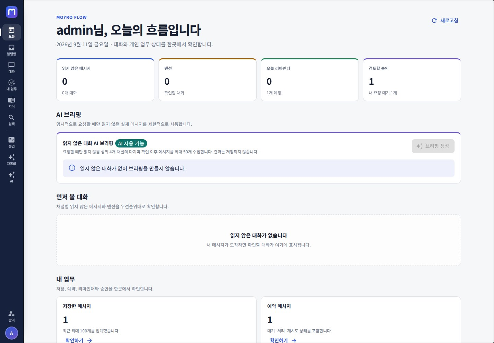

숫자는 서버가 채널별로 세어 둔 값이고, 어느 영역의 조회가 실패하면 0으로 표시하지
않고 그 자리에 경고를 띄웁니다. 숫자가 비어 있는 것과 못 읽은 것을 구분해서 보세요.

**AI 브리핑**은 눌렀을 때만 동작합니다. 읽지 않음 상위 4개 채널의 마지막 확인 이후
메시지를 최대 50개까지 모아 요약하고, 결과는 저장하지 않습니다.

### 2.3 채널에서 첫 메시지 쓰기

레일의 **대화**에서 팀과 채널을 고릅니다. 아래 작성기에 메시지를 쓰고 보내면 됩니다.
파일 첨부, 반응, 수정, 삭제, 스레드 답글을 모두 이 화면에서 씁니다.

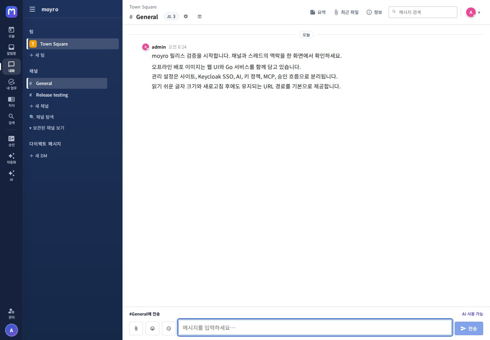

주소창의 URL은 지금 보고 있는 팀·채널을 그대로 담고 있습니다. 새로고침해도 같은
채널이 열리고, 그대로 복사해 동료에게 보낼 수 있습니다.

### 2.4 나중에 볼 것 챙기기

메시지 위에 마우스를 올리면 동작 버튼이 나오고, **메시지 작업 더보기**에 나머지가
들어 있습니다. 여기서 두 가지를 자주 씁니다.

- **저장** — 나중에 볼 메시지를 모읍니다. **내 업무 → 저장한 메시지** 에서 다시 보고
  **저장 해제** 합니다.
- **나중에 알림** — 정한 시각에 알림을 받습니다. **내 업무 → 리마인더** 에서
  확인·취소합니다.

같은 메뉴에 **스레드 열기 · 리액션 추가 · 편집 · 삭제 · 링크 복사 · 텍스트 복사 ·
여기부터 안 읽음**과 아래에서 설명하는 **작업으로 만들기 · 결정으로 기록 ·
대화에서 문서 만들기**가 함께 있습니다.

여기까지가 첫 5분입니다. 이제 화면별로 무엇을 할 수 있는지 봅니다.

---

## 3. 화면별 사용법

### 3.1 통합 알림함

레일의 **알림함**(통합 알림함)은 나에게 온 일을 모아 두는 곳입니다. 탭은
**업데이트 · 대화 · 승인 · 리마인더** 넷이고, 각 탭 이름 옆의 숫자가 남은 건수입니다.

**업데이트** 탭에는 멘션, DM, 내가 참여한 스레드의 답글, 승인 요청과 결과, 리마인더,
작업 할당, 지원되는 플러그인 알림이 들어옵니다. 이 상태는 브라우저가 아니라 서버에
저장되므로 다른 기기로 로그인해도 읽은 것은 읽은 상태입니다.

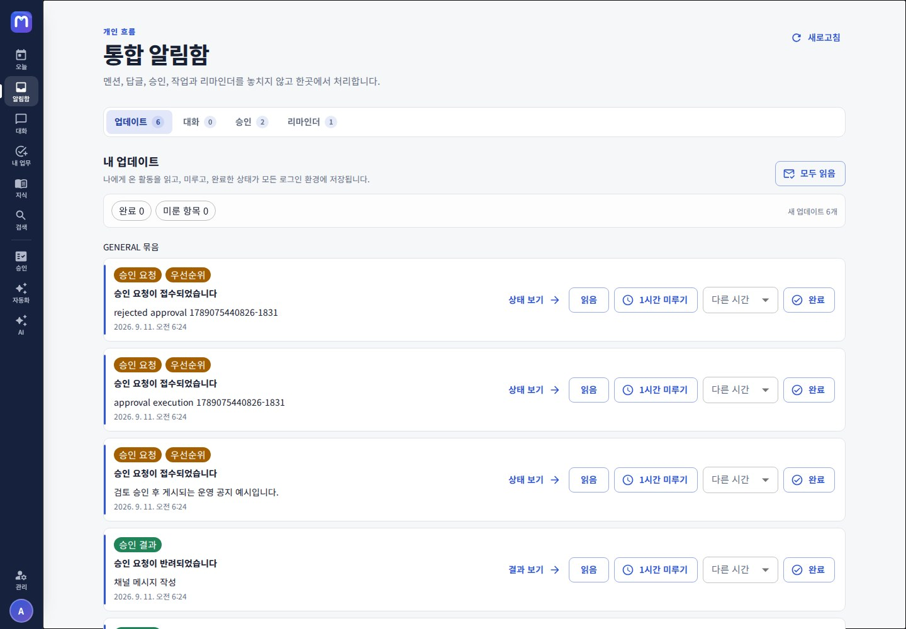

항목마다 **상태 보기**(원래 자리로 이동), **읽음**, **1시간 미루기** 또는
**다른 시간**, **완료** 버튼이 있습니다. 위쪽 **모두 읽음**은 지금 목록 전체에
적용되고, **완료** · **미룬 항목** 칩으로 처리한 것만 다시 볼 수 있습니다. 항목은
채널별로 묶여 표시됩니다.

**대화** 탭은 채널별 읽지 않은 메시지와 멘션을 봅니다. 각 줄의 **채널 전체 읽음**은
항목 하나가 아니라 그 채널의 현재 메시지 전체에 적용됩니다. 읽지 않은 채널이 없으면
`읽지 않은 채널이 없습니다` 가 표시됩니다.

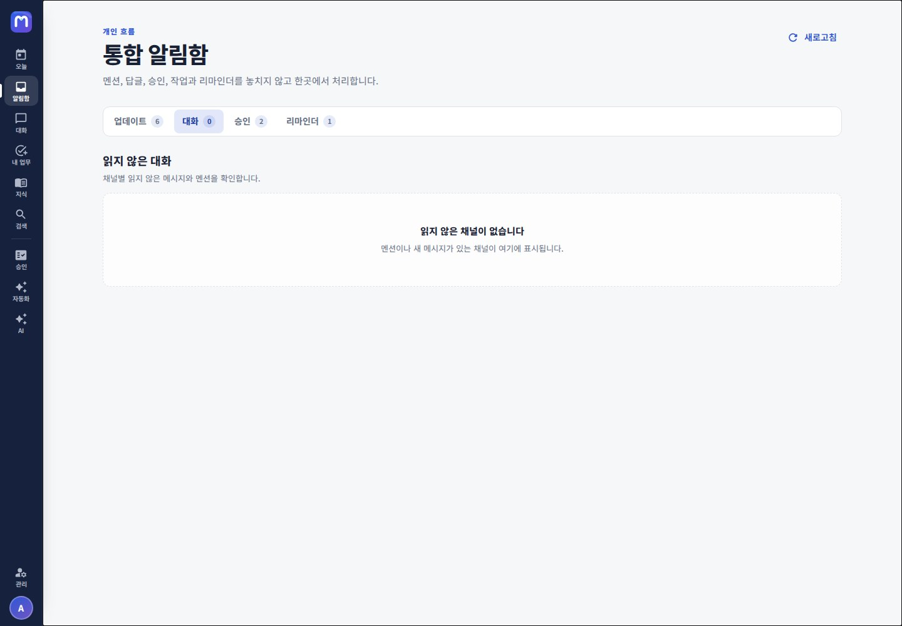

**승인** 탭과 **리마인더** 탭은 각각 승인 센터와 리마인더 목록의 요약 진입점입니다.
승인 탭에는 서버가 내 권한 범위 안에서 허용한 항목만 나타납니다.

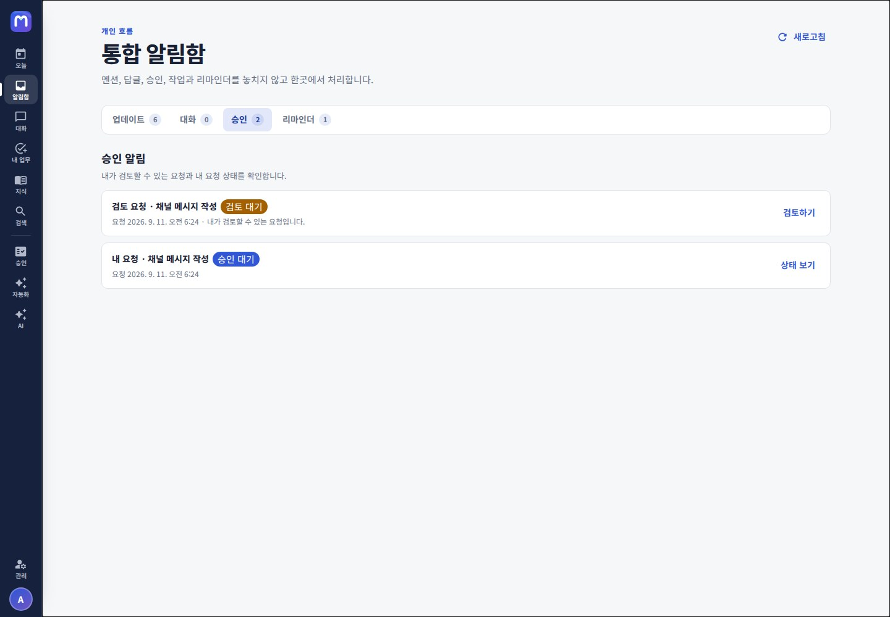

채널에서 나가면 그 채널에서 온 항목도 이후 목록에서 보이지 않습니다.

### 3.2 채널 작업 공간과 컨텍스트 패널

공개·비공개 채널, DM과 그룹 메시지를 모두 같은 화면에서 씁니다. 왼쪽에 팀과 채널
목록(**새 팀 · 새 채널 · 채널 탐색 · 보관된 채널 보기 · 다이렉트 메시지**), 가운데
메시지, 아래 작성기가 있습니다. 채널 이름 옆 상단에는 **요약 · 최근 파일 · 정보**
버튼과 채널 안 **메시지 검색** 상자가 있습니다.

이 버튼들은 오른쪽 컨텍스트 패널을 엽니다. 패널 탭은 **스레드 · 요약 · 최근 파일 ·
고정 · 멤버 · 정보** 입니다.

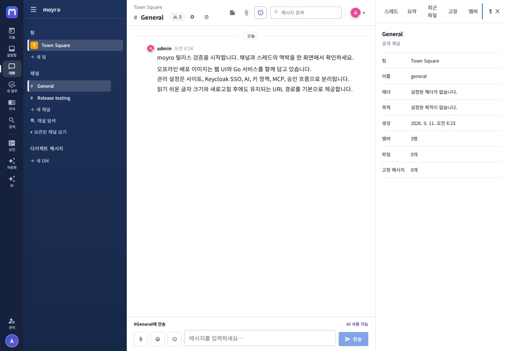

- **스레드** — 선택한 메시지의 답글을 채널을 떠나지 않고 읽고 씁니다.
- **요약** — 버튼을 눌렀을 때 **지금 브라우저에 로드된 최근 메시지만** AI에 보내
  요약합니다. 무엇을 입력으로 썼는지 함께 보여 줍니다. 조직 전체 검색이 아닙니다.
- **최근 파일** — 지금 로드된 메시지의 첨부만 모읍니다.
- **고정** · **멤버** — 고정한 메시지와 채널 멤버를 봅니다.
- **정보** — 팀, 이름, 헤더, 목적, 생성 시각, 멤버·파일·고정 메시지 수를 봅니다.

탭 사이는 좌우 화살표 키로 옮기고, `Esc` 로 닫으면 패널을 열었던 버튼으로 포커스가
돌아갑니다.

오른쪽 위 **계정 메뉴 열기** 버튼을 누르면 개인 설정과, 권한이 있는 경우 서비스 관리
진입점이 보입니다. 서비스 버전도 여기서 다시 확인할 수 있습니다.

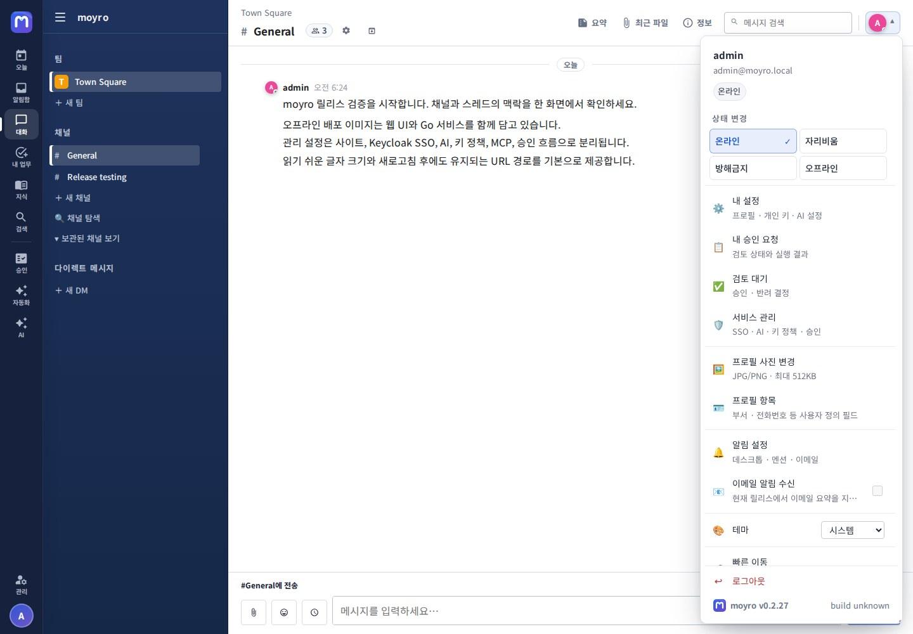

### 3.3 내 업무

레일의 **내 업무**는 대화에서 만든 작업·결정과 개인 항목을 모읍니다. 탭은
**내 작업 · 내 결정 · 저장한 메시지 · 예약 메시지 · 리마인더** 다섯입니다.

**내 작업**은 **목록 · 보드 · 캘린더 · 타임라인**으로 전환해 봅니다. 각 줄에
**상세·이력**, **원문 메시지**, **시작**, **완료**, **삭제** 동작이 있습니다.
우선순위, 일/주/월 반복, 선행 작업을 지정할 수 있습니다. 끝나지 않은 선행 작업이
있으면 서버가 시작·완료를 막고, 반복 작업을 완료하면 다음 회차 한 건이 자동으로
생깁니다. 담당자는 원본 채널의 현재 멤버 중에서만 고를 수 있습니다.

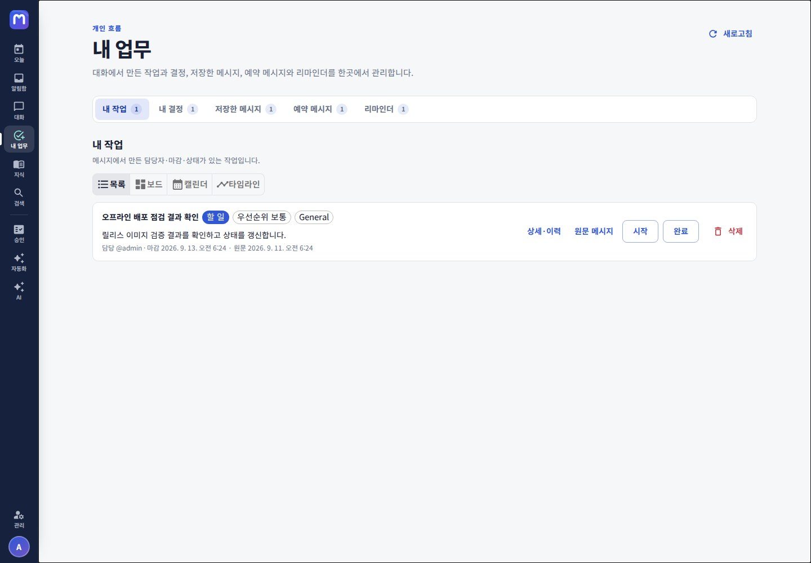

**내 결정**은 제안 → 검토 중 → 기록 단계와 대체·취소 상태를 씁니다. 영향받는 작업과
연결하고 변경 이력을 남깁니다. 이력은 원본 채널의 현재 멤버에게만 보입니다.

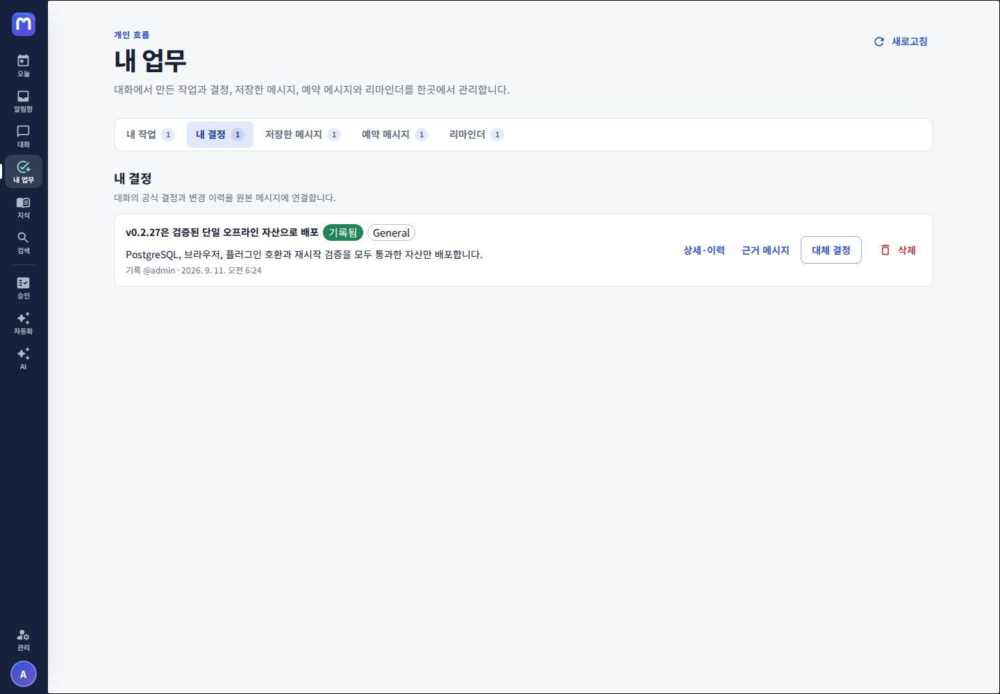

**저장한 메시지**는 저장해 둔 메시지 목록입니다. 여기서 저장을 해제합니다.

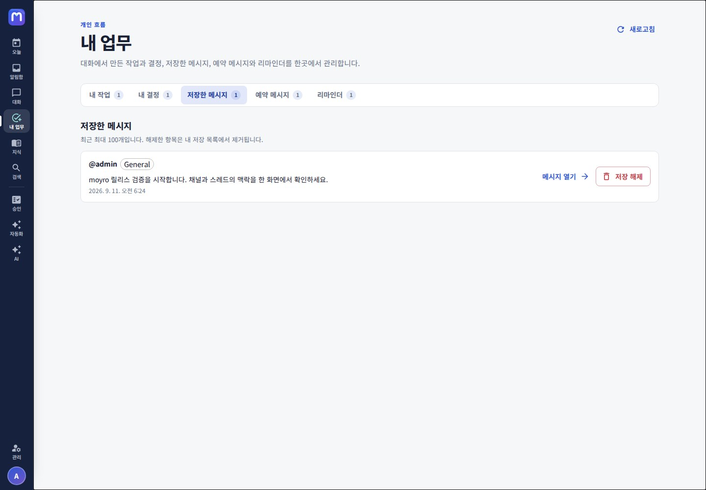

**예약 메시지**는 아직 보내지 않은 메시지입니다. 상태, 발송 예정 시각, 최근 오류를
보여 주고 발송 전에 취소할 수 있습니다.

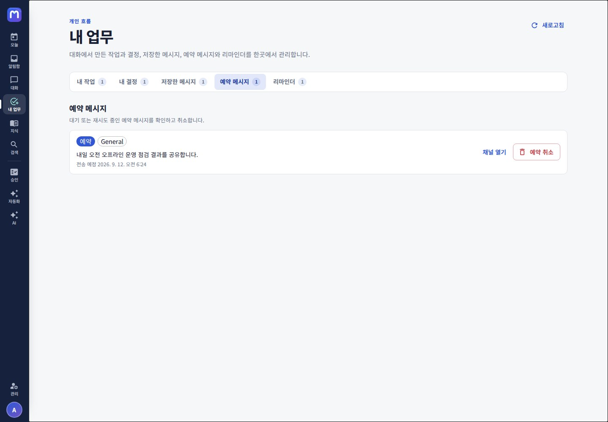

**리마인더**는 내가 걸어 둔 알림입니다. 원문과 알림 시각을 확인하고 취소합니다.

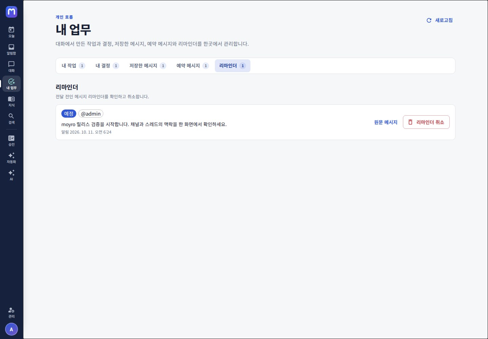

작업과 결정은 각각 따로 더 불러오므로 한쪽이 많아도 다른 탭의 첫 페이지가 밀리지
않습니다.

### 3.4 검색과 지식 검색

찾는 화면이 둘입니다. 레일의 **검색**은 **메시지 검색**이고, **지식**은
**지식 검색**입니다.

**메시지 검색**은 접근할 수 있는 팀을 하나 고르고 검색어로 그 팀의 메시지를 찾습니다.

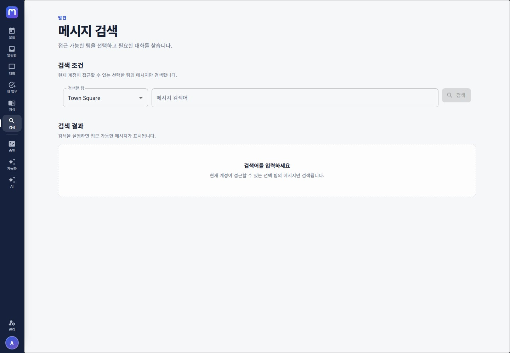

- 검색어 없이 필터만으로는 검색되지 않습니다(`검색어를 입력하세요`).
- 가입한 팀이 없으면 `검색 가능한 팀이 없습니다` 가 표시됩니다.
- 결과가 없으면 `검색 결과가 없습니다` 가 표시됩니다.

**지식 검색**은 내가 현재 참여 중인 채널의 메시지와 대화 문서를 함께 찾습니다.

- 각 결과에 `[M#]`(메시지) 또는 `[D#]`(문서) 근거 카드가 붙습니다.
- AI를 쓸 수 있으면 이 근거 카드만 넘겨 출처가 붙은 답변을 만듭니다. AI가 없거나
  실패해도 검색 결과 자체는 그대로 남습니다
  (`AI 설정을 불러오지 못했습니다. 원문 지식 검색은 계속 사용할 수 있습니다.`).

두 화면 모두 결과에서 원문을 열면 채널 작업 공간이 그 메시지 위치로 이동해 스크롤하고
포커스를 옮깁니다. 삭제됐거나 접근할 수 없는 메시지는 비슷한 다른 메시지로 대신 열지
않고 오류를 보여 줍니다.

### 3.5 AI 대화

관리자가 AI 공급자를 켜고 나에게 권한을 준 경우에만 레일에 **AI**가 나타납니다.

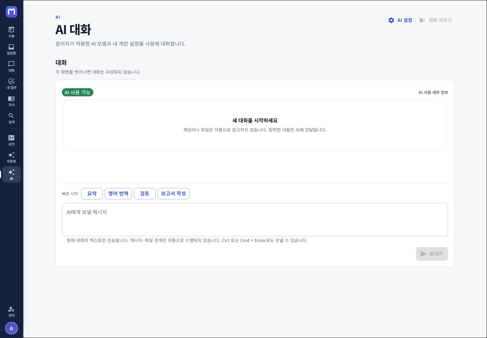

- 답변에 붙는 `[M#]`/`[D#]`는 아래 출처 카드와 같은 번호입니다.
- 대화 이력은 **지금 브라우저 세션에만** 있습니다. 새로고침하면 사라지고 서버에
  저장되지 않습니다.
- 권한이 없으면 `AI 사용 권한이 없습니다.`, 내 설정에서 꺼 두었으면
  `개인 AI 설정이 꺼져 있습니다.` 가 나옵니다.

메시지 메뉴의 **대화에서 문서 만들기**는 스레드 전체를 불러와 Markdown 초안을 만들고
원본 표시(watermark)와 함께 저장합니다. 이후 원문이 바뀌면 문서를 '오래됨'으로
표시하며, 최신 원문으로 다시 만들 수 있습니다. 제목·본문 수정은 동시 편집 충돌을
감지하고, 저장·삭제는 작성자만 할 수 있습니다.

### 3.6 승인 센터

레일의 **승인**(승인 센터)에는 **내 요청**과 **검토 대기** 두 탭이 있습니다.

**내 요청**은 내가 올린 요청의 상태입니다.

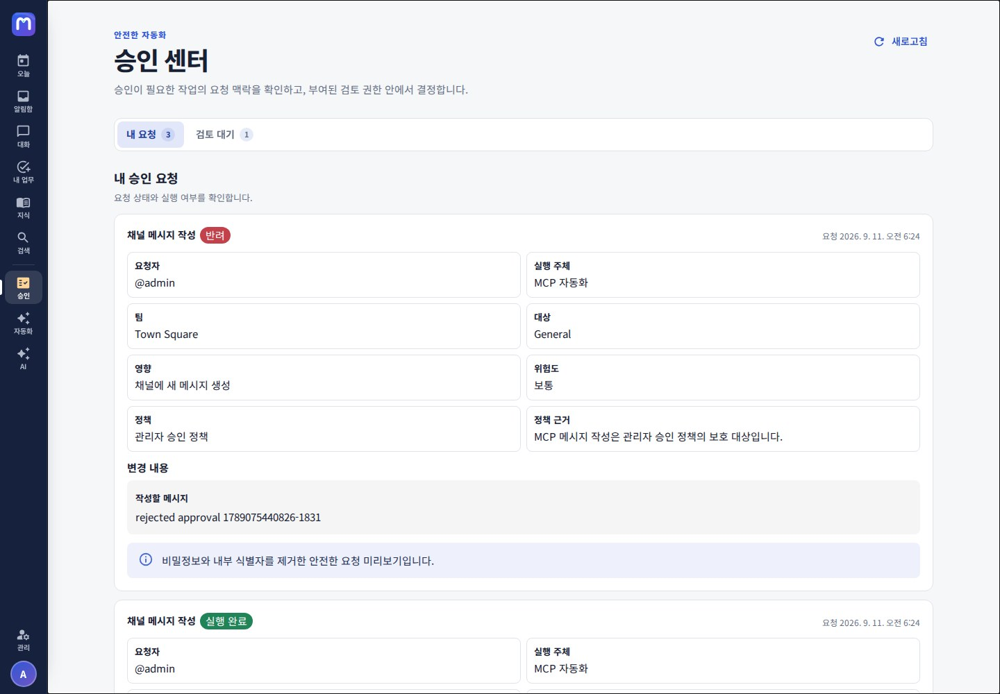

**검토 대기**는 내가 검토할 수 있는 요청입니다. 권한이 없으면 목록이 비고, 서버가
접근을 거부합니다(`검토할 요청이 없습니다`).

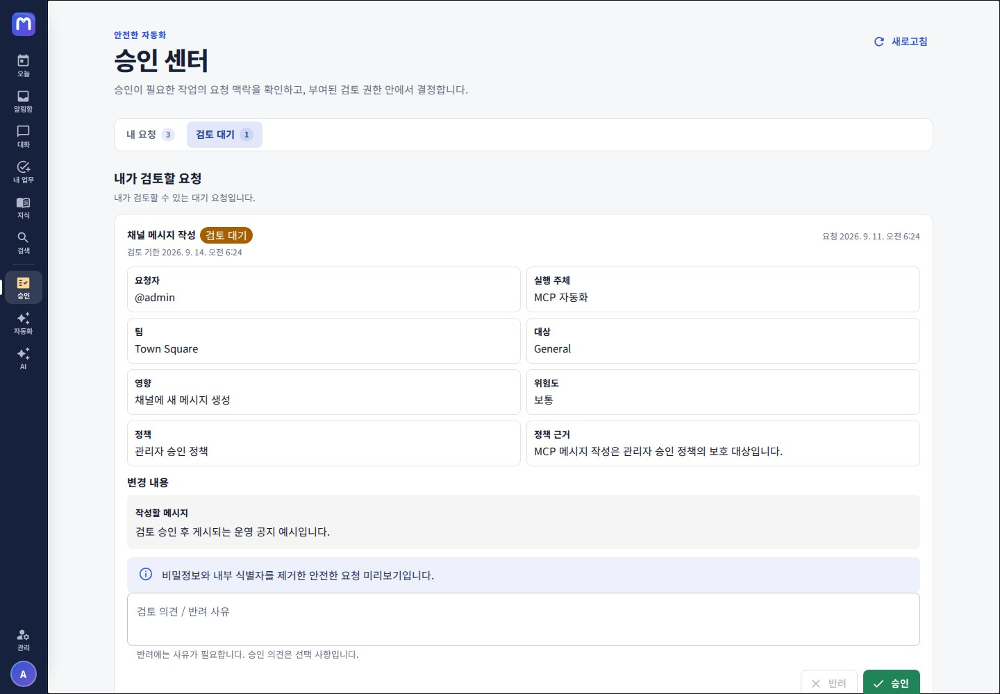

목록에 보이는 내용은 실행 원본 JSON이 아니라 서버가 만든 제목·위험 수준·주체·대상·
변경 내용·정책 근거입니다. 비밀값 형태의 문자열은 가려지고 길이도 제한됩니다.
검토 기한이 지난 요청은 처리할 수 없습니다(`검토 기한이 지난 요청은 처리할 수 없습니다. 최신 상태를 다시 확인하세요.`).

승인 정책은 기본적으로 꺼져 있습니다. 관리자가 켠 경우에만 새 요청이 생깁니다.

### 3.7 개인 설정

프로필 메뉴에서 개인 설정으로 들어갑니다. 왼쪽 메뉴는 **프로필 · 화면 · 알림 ·
보안 · 세션 · 개인 키 · AI 개인화** 이며, 뒤의 둘은 권한이 있을 때만 보입니다.

**프로필** — 이름, 사용자명, 프로필 이미지 등 다른 사람에게 보이는 정보입니다.

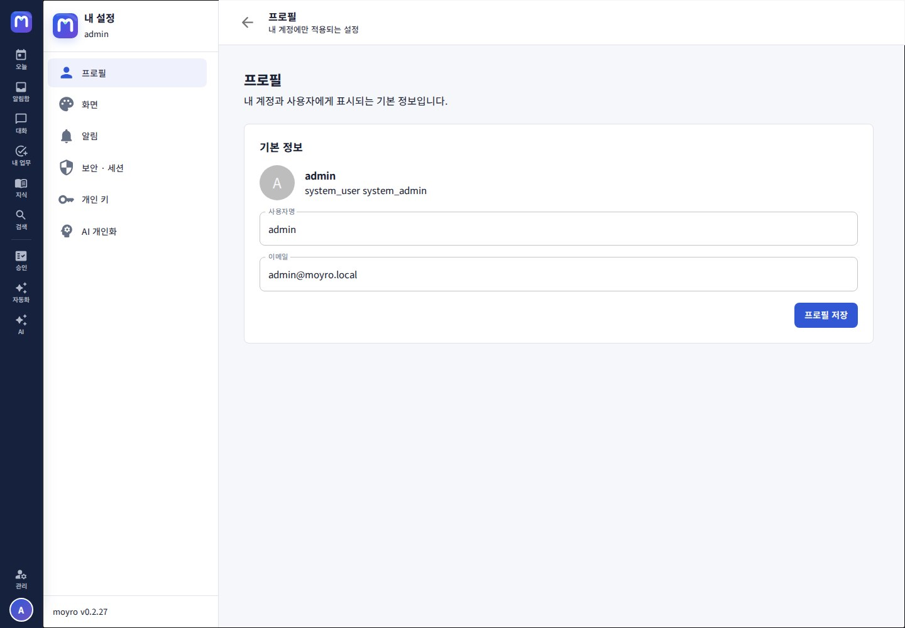

**화면** — 글꼴 크기와 색상 모드를 고릅니다.

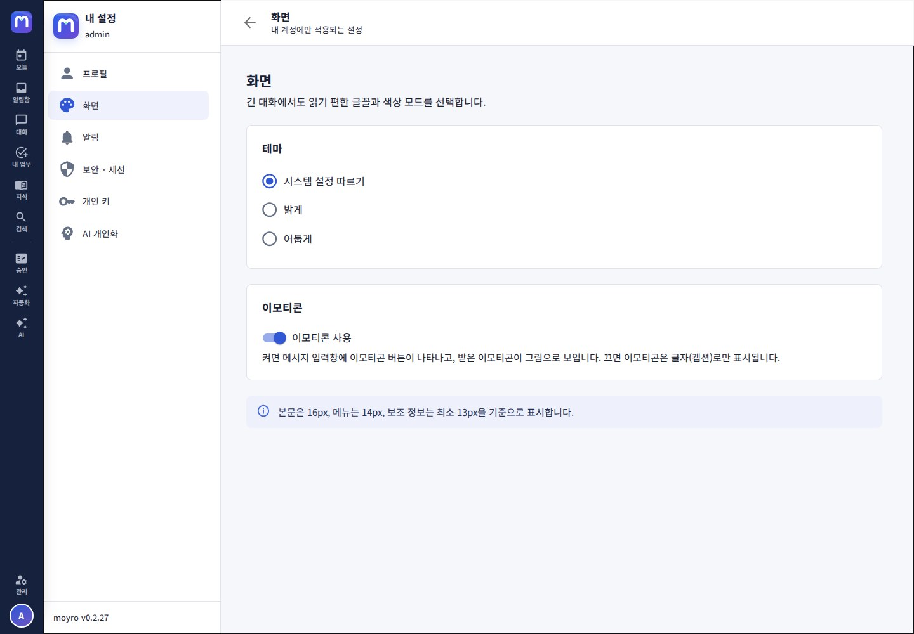

**알림** — 이메일과 기본 알림 방식, VIP·이벤트 우선순위, 채널/종류별 묶음, 시간대와
요일·시각 기준 근무시간, 근무시간 밖에도 받을 예외를 저장합니다.

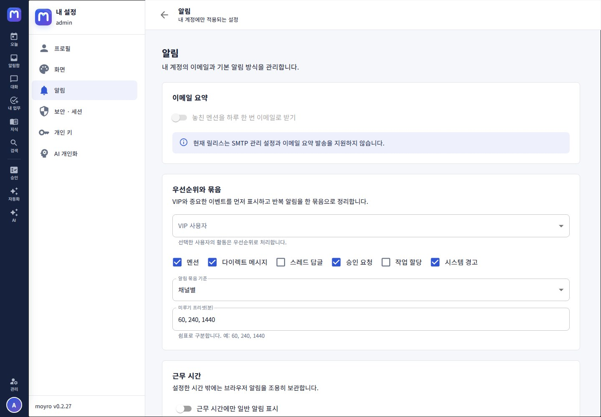

**보안 · 세션** — 지금 로그인된 기기 목록입니다. 다른 기기를 모두 로그아웃하면 이
기기의 세션만 남습니다(`다른 모든 기기에서 로그아웃할까요? 이 기기의 세션은 유지됩니다.`).

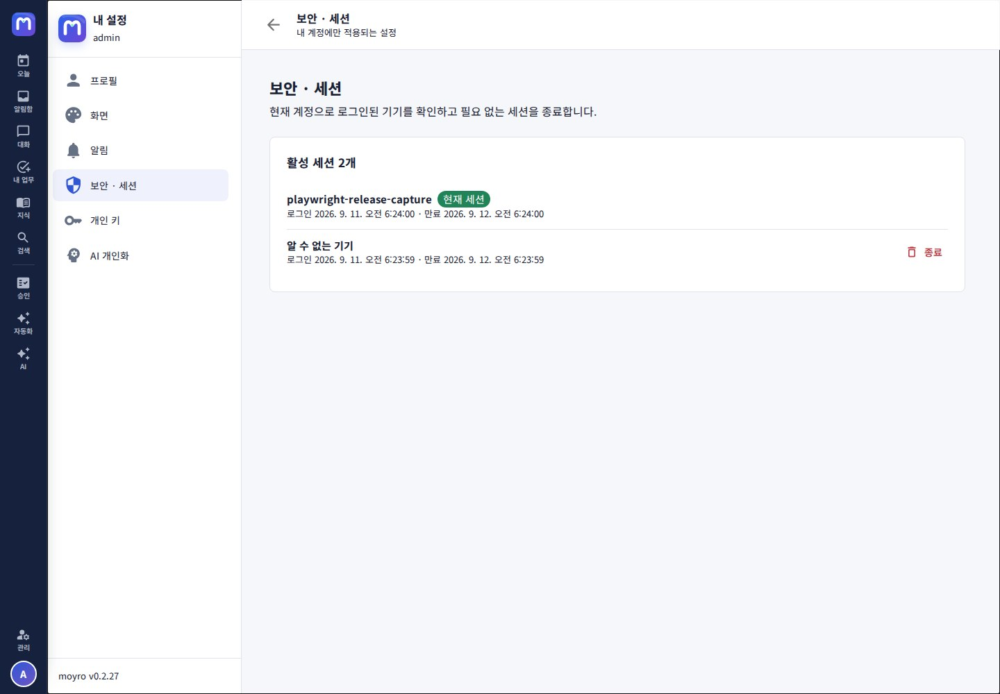

**개인 키** — API나 MCP 클라이언트에서 쓸 개인 키를 만들고 회전·폐기합니다. 관리자가
허용한 범위와 수명 안에서만 만들 수 있고, 비밀값은 **만들 때 한 번만** 보입니다.

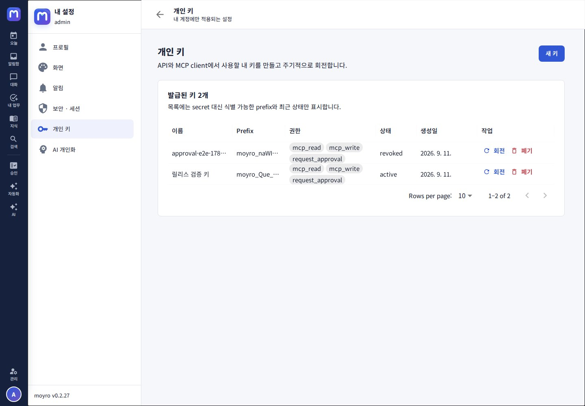

**AI 개인화** — 관리자가 허용한 공급자 안에서 기본 모델과 응답 특성을 고릅니다.

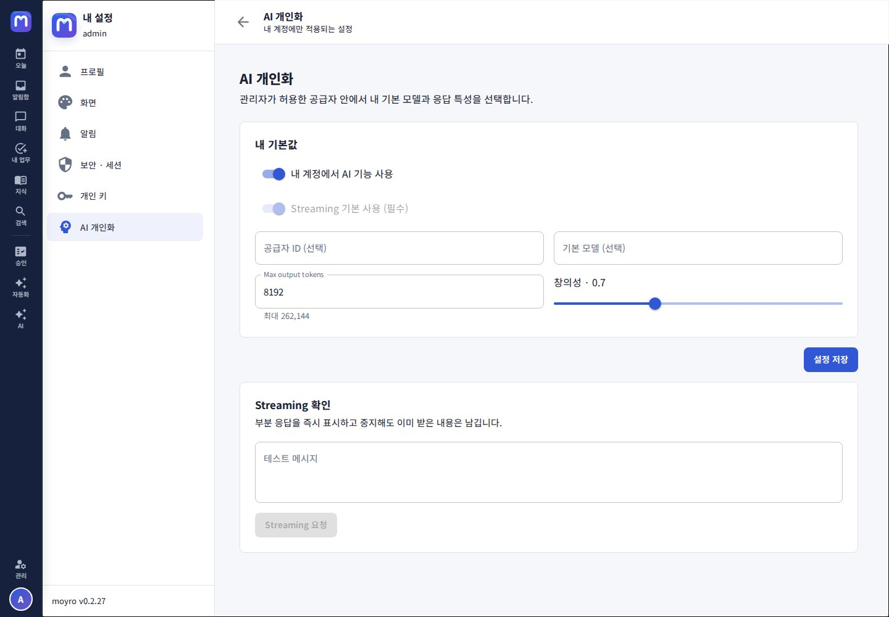

작성 중인 초안은 관리자가 정한 정책에 따라 이 기기에 보관됩니다. 기본값은 7일
보관이며 화면에 **이 기기에 초안 저장됨**이라고 표시됩니다. 조직에 따라 현재 세션
동안만 보관하거나 아예 보관하지 않을 수 있습니다.

### 3.8 모바일 화면

좁은 화면에서는 아래쪽 탐색으로 **오늘 · 대화 · 알림함 · 검색**을 열고, 내 업무·승인·
AI·설정은 **더보기**에서 엽니다. 가로 스크롤 없이 한 열로 배치됩니다.

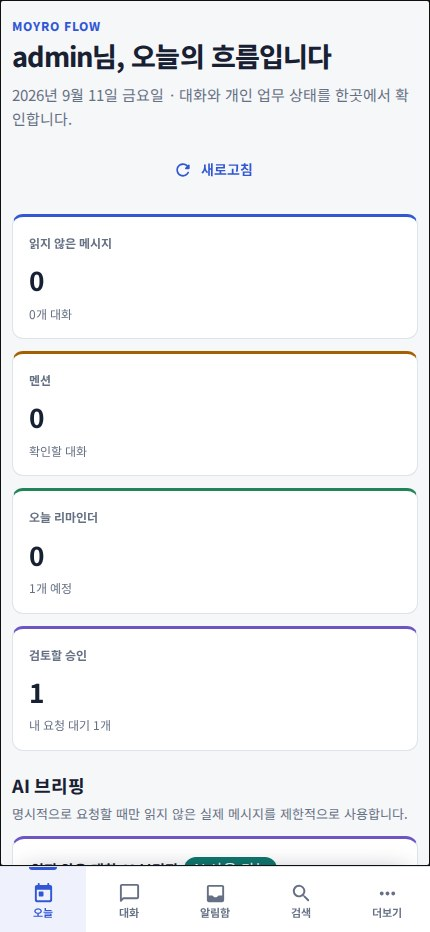

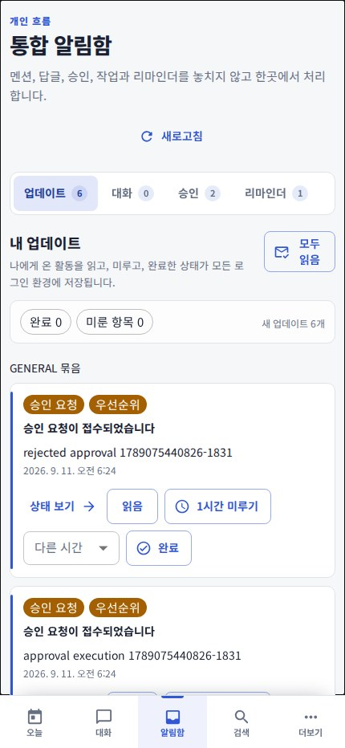

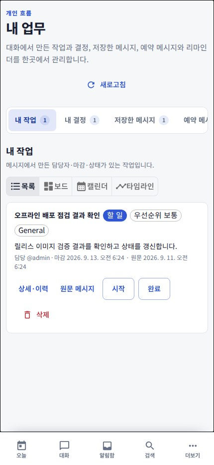

메시지를 길게 누르면 저장·리마인더 같은 동작 메뉴가 열립니다.

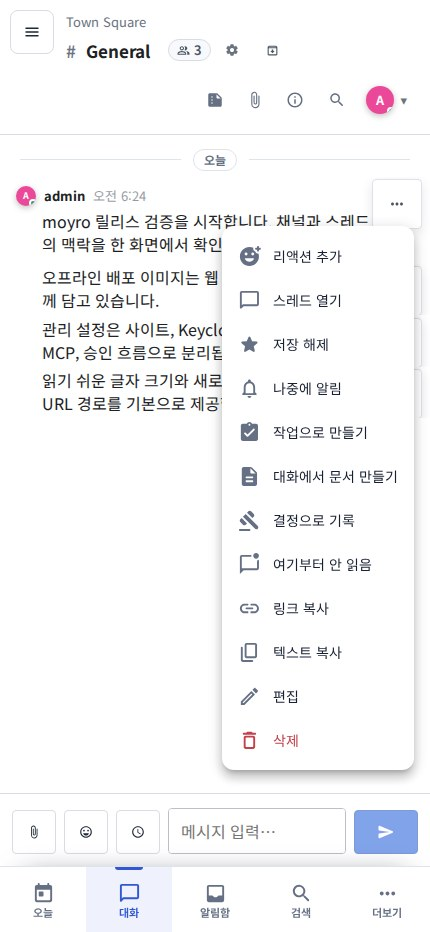

컨텍스트 패널은 아래 탐색 위로 전체 화면으로 열리고, `Esc` 로 닫으면 원래 버튼으로
포커스가 돌아갑니다.

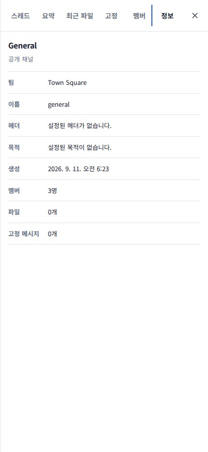

---

## 4. 자주 하는 작업

### 회의에서 정한 것을 결정으로 남기기

1. 결정 근거가 된 메시지를 채널에서 찾습니다.
2. 메시지 메뉴에서 **결정으로 기록**을 고릅니다.
3. 제목과 내용을 적고 검토자를 지정합니다.
4. **내 업무 → 내 결정** 에서 제안 → 검토 중 → 기록 단계로 옮깁니다.
5. 나중에 바뀌면 새 결정을 만들어 **대체**로 처리합니다. 대체 결정은 즉시 확정되어
   기존 결정을 대체합니다.

결정에는 원본 메시지 링크가 남으므로 몇 달 뒤에도 근거를 다시 열 수 있습니다.

### 대화에서 할 일 뽑아 담당자에게 넘기기

1. 할 일이 언급된 메시지에서 **작업으로 만들기**를 고릅니다.
2. 담당자(그 채널의 현재 멤버)와 기한을 정합니다.
3. 선행 작업이 있으면 지정합니다 — 선행이 끝나기 전에는 서버가 시작·완료를 막습니다.
4. **내 업무 → 내 작업** 의 보드나 캘린더에서 진행 상태를 봅니다.

### 지금 못 읽는 메시지를 나중으로 미루기

- 그 메시지에 **나중에 알림**을 걸어 두면 정한 시각에 알림이 옵니다.
- 알림함 항목이라면 **미루기**를 씁니다. 정한 시간 뒤 다시 나타납니다.
- 그냥 모아만 두려면 **저장**을 씁니다.

세 가지는 각각 다른 목록에 쌓입니다. 리마인더는 시각이 있고, 저장은 시각이 없습니다.

### 업무 시간에 맞춰 보낼 메시지 예약하기

1. 작성기에서 메시지를 씁니다.
2. 보내기 대신 예약을 골라 시각을 정합니다.
3. **내 업무 → 예약 메시지** 에서 대기·재시도 상태를 보고, 보내기 전이면 취소합니다.

### 긴 채널을 따라잡기

1. 해당 채널을 엽니다.
2. 오른쪽 컨텍스트 패널의 **요약** 탭에서 요약 버튼을 누릅니다.
3. 요약에 쓰인 입력 메시지 목록을 함께 확인합니다 — 지금 화면에 로드된 범위입니다.
4. 더 앞의 내용이 필요하면 위로 스크롤해 더 불러온 뒤 다시 요약합니다.

### 예전 논의 찾기

1. 레일의 **검색**(메시지 검색) 또는 **지식**(지식 검색)을 엽니다.
2. 검색어를 넣고, 필요하면 팀·채널로 좁힙니다.
3. 지식 검색이라면 결과의 `[M#]`/`[D#]` 카드에서 원문을 엽니다.
4. 결과가 없으면 `검색 결과가 없습니다` 가 표시됩니다 — 내가 그 채널의 멤버가 맞는지
   먼저 확인하세요. 접근할 수 없는 메시지는 검색되지 않습니다.

### 자동화 도구에서 쓸 개인 키 만들기

1. **개인 설정 → 개인 키** 에서 새 키를 만듭니다.
2. 용도에 맞는 범위(scope)를 고릅니다 — 관리자가 허용한 범위만 보입니다.
3. 표시된 비밀값을 그 자리에서 안전한 곳에 옮깁니다. 다시 볼 수 없습니다.
4. 수명이 다가오면 회전하고, 쓰지 않는 키는 폐기합니다.

MCP 클라이언트에는 `kind=mcp` 키를 씁니다.

---

## 5. 막혔을 때

가장 먼저 할 일 두 가지입니다. 현재 URL을 새로고침해 같은 화면이 다시 열리는지
보고, 프로필 메뉴에서 서비스 버전을 확인합니다. 관리자에게 문의할 때는 **서비스 버전,
발생 시각, 현재 URL, 직전에 한 동작**을 함께 전달하세요.

| 화면에서 보이는 것 | 뜻과 할 일 |
|---|---|
| `초대 링크가 유효하지 않습니다.` | 링크가 만료됐거나 사용 횟수를 다 썼습니다. 관리자에게 새 링크를 요청하세요. |
| `로그인 세션이 만료되었습니다. 다시 시도해 주세요.` | SSO 로그인이 제한 시간을 넘겼습니다. 로그인을 처음부터 다시 하세요. |
| `보안 상태값이 일치하지 않습니다. 다시 로그인해 주세요.` | 로그인 중간에 창을 옮겼거나 오래된 탭입니다. 새 탭에서 다시 로그인하세요. |
| `로그인 세션을 완료할 수 없습니다. 아래 버튼으로 SSO 로그인을 새로 시작해 주세요.` | 자동 재시도까지 실패한 상태입니다. 버튼으로 새로 시작하세요. 반복되면 관리자에게. |
| `SSO 그룹 기반 팀·채널 권한을 안전하게 적용하지 못했습니다. 관리자에게 문의한 뒤 다시 시도해 주세요.` | 그룹 매핑 문제입니다. 사용자가 고칠 수 없습니다 — 관리자에게 넘기세요. |
| `이메일이 확인되지 않아 기존 계정과 자동 연결할 수 없습니다. 기존 비밀번호로 먼저 로그인해 주세요.` | 기존 로컬 계정으로 먼저 로그인한 뒤 SSO를 다시 시도하세요. |
| `계정을 처리하지 못했습니다. 관리자에게 문의해 주세요.` | 계정 생성·연결이 서버에서 거부됐습니다. 관리자에게 넘기세요. |
| `게스트 접근 시간이 만료되었습니다.` | 게스트 계정의 접근 기간이 끝났습니다. 초대한 담당자에게 연장을 요청하세요. |
| `검색어를 입력하세요` | 팀만 고르고 검색어를 넣지 않았습니다. 검색어를 넣으세요. |
| `검색 가능한 팀이 없습니다` | 아직 어느 팀에도 속하지 않았습니다. 관리자나 팀 담당자에게 초대를 요청하세요. |
| `AI 사용 권한이 없습니다.` | 관리자가 AI 권한을 주지 않았습니다. 관리자에게 넘기세요. |
| `개인 AI 설정이 꺼져 있습니다.` | 내가 끈 상태입니다. **개인 설정 → AI 개인화** 에서 켜세요. |
| `AI 설정을 불러오지 못했습니다. 원문 지식 검색은 계속 사용할 수 있습니다.` | AI만 실패했습니다. 검색 결과는 그대로 쓸 수 있습니다. |
| `검토 기한이 지난 요청은 처리할 수 없습니다. 최신 상태를 다시 확인하세요.` | 승인 대기 기한이 지났습니다. 요청자에게 다시 올려 달라고 하세요. |
| `MCP 쓰기는 검토가 필요합니다.` / `MCP 메시지 작성은 관리자 승인 정책의 보호 대상입니다.` | 승인 정책이 걸린 작업입니다. 승인 센터에서 처리될 때까지 기다리세요. |
| `MCP transport가 비활성화되어 있습니다.` | 관리자가 MCP를 켜지 않았습니다. 관리자에게 넘기세요. |
| 채널이나 파일이 열리지 않음 | 그 채널의 멤버인지 확인하세요. 멤버십을 잃으면 관련 알림함 항목과 검색 결과도 함께 사라집니다. |
| 로그인 화면에 SSO 버튼이 없음 | 관리자가 Keycloak를 켜지 않았습니다. 관리자에게 문의하세요. |
| 화면 전체가 연결 오류 | 내부망 연결 문제일 수 있습니다. 관리자에게 서비스 상태 점검(`/healthz`)을 요청하세요. |

`불러오지 못했습니다` 로 끝나는 메시지는 대체로 그 화면의 조회 하나가 실패한 것입니다.
새로고침으로 대개 해결되고, 계속되면 관리자에게 발생 시각과 함께 알리세요.

자동화나 외부 클라이언트를 붙일 때는 Mattermost 호환 `/api/v4` 와 moyro 전용
`/api/moyro/v1` 계약이 다르다는 점에 주의하세요. 각각
[`openapi-v4.yaml`](openapi-v4.yaml), [`openapi-moyro.yaml`](openapi-moyro.yaml)에
있습니다.

---

## 6. 용어

| 말 | 뜻 |
|---|---|
| **Moyro Flow** | 오늘·알림함·대화·내 업무·검색·승인을 하나로 묶은 이 제품의 화면 구성. |
| **글로벌 레일** | 화면 왼쪽 끝에서 주요 화면을 오가는 세로 막대. 모바일에서는 아래쪽 탐색이 대신합니다. |
| **통합 알림함** | 멘션·DM·스레드 답글·승인·리마인더·작업 할당을 모은 목록. 읽음/미룸/완료 상태가 서버에 저장됩니다. |
| **컨텍스트 패널** | 채널 오른쪽에서 스레드·요약·파일·정보를 여는 영역. |
| **작업 / 결정** | 대화에서 만들어 원본 메시지와 연결되는 업무 항목. 작업은 담당자와 기한, 결정은 단계와 이력을 가집니다. |
| **대화 문서** | 스레드를 모아 만든 Markdown 문서. 원본이 바뀌면 '오래됨'으로 표시됩니다. |
| **근거 카드 `[M#]` / `[D#]`** | 검색·AI 답변이 인용한 원문(메시지 / 문서)을 가리키는 번호표. |
| **승인 센터** | 관리자가 정한 보호 작업을 검토·승인·반려하는 화면. 기본은 꺼짐입니다. |
| **개인 키** | 내 계정으로 API·MCP를 쓰기 위한 토큰. 만들 때 한 번만 보입니다. |
| **MCP** | 외부 자동화가 moyro의 허용된 기능만 쓰도록 하는 연결 방식. 관리자가 켜야 동작합니다. |
| **게스트** | 지정된 채널과 만료 기간 안에서만 쓸 수 있는 외부 협업자 계정. |
| **예약 메시지** | 정한 시각에 서버가 대신 보내는 메시지. 보내기 전까지 취소할 수 있습니다. |
| **리마인더** | 정한 시각에 특정 메시지를 다시 알려 주는 개인 알림. |

---

## 더 볼 것

- [관리자 가이드](ADMIN_GUIDE.md) — 설치, 설정, 계정과 권한, 운영, 장애 대응
- [오프라인 배포](offline-deployment.md) — 릴리즈 자산으로 설치하는 상세 절차
- [제품 화면 갤러리](screens.html) — 브라우저로 찍은 전체 화면 모음
