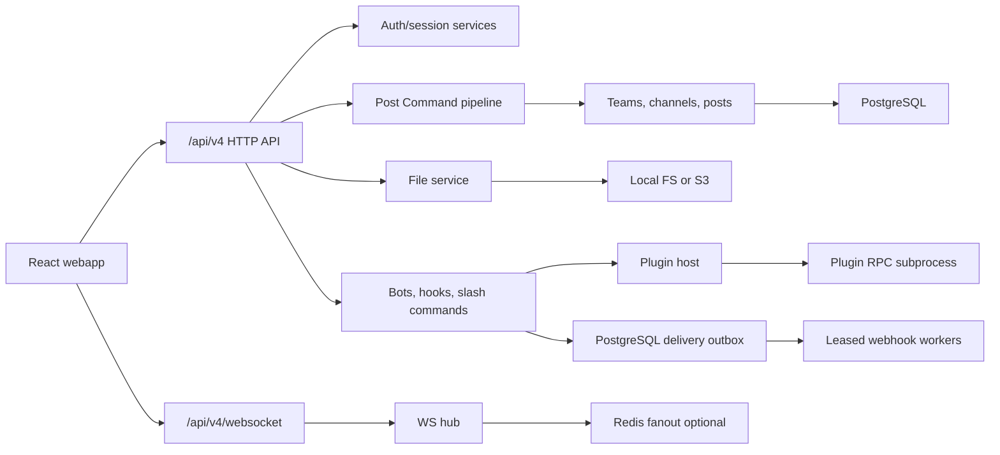

# Architecture

moyro is a small monorepo with a Go backend and a React web client. The server
owns compatibility with Mattermost-style `/api/v4` HTTP endpoints, WebSocket
events, webhooks, slash commands, and server plugin hooks. The webapp owns the
end-user chat experience and a lightweight web plugin registry.

## Server

Entry point: `server/cmd/moyro/main.go`.

The process loads config, opens PostgreSQL, runs checksummed versioned
migrations, bootstraps a default team/channel, starts the WebSocket hub,
optional Redis fanout, plugin host, configured email digest worker, scheduled
message worker, reminder worker, and HTTP server.

Important packages:

- `internal/httpapi` wires routes and request handlers. Core handlers and the
  later compatibility waves live in separate files so one route family no
  longer owns the entire compatibility surface.
- `internal/application/postcommand` owns the shared post-write lifecycle for
  REST, MCP, scheduled, incoming-webhook, and slash-command adapters.
- `internal/store` owns immutable numbered migrations, checksums, the
  `schema_migrations` ledger, and startup advisory locking.
- `internal/auth`, `internal/pat`, `internal/oauth` handle identity and access.
- `internal/teams`, `internal/channels`, `internal/posts` are the chat core.
- `internal/files` supports local filesystem storage and S3-compatible storage.
- `internal/ws` owns live client connections and event broadcast.
- `internal/webhooks`, `internal/slashcmd`, `internal/bots` implement
  integration surfaces. Outgoing callbacks use PostgreSQL leases, retry
  history, deterministic delivery IDs, and dead-letter state.
- `internal/pluginhost` and `internal/rpcbridge` implement server plugin hooks.
- `internal/scheduled` and `internal/reminders` run background delivery loops.
- `internal/metrics` exposes Prometheus metrics.

## Webapp

Entry point: `webapp/src/main.tsx`.

The React app initializes the plugin runtime, mounts Redux, and switches between
login and chat views. Login, workspace, personal settings, and each
administrator page are route-level lazy modules. `ChatView.tsx` remains the
large workspace shell and is held behind a source-size ratchet while its
sidebar, messages, composer, thread, and personal-workflow features are split
incrementally.

Important modules:

- `api/client.ts` is the typed API boundary for HTTP and WebSocket URLs.
- `hooks/useWebsocket.ts` owns reconnect and stale-socket guards.
- `components/MessageBody.tsx` renders sanitized Markdown and link previews.
- `components/IntegrationsPanel.tsx` exposes admin integration management.
- `plugins/runtime.ts` and `plugins/registry.ts` provide web plugin loading.

## Data Flow

1. REST, MCP, a scheduled worker, an incoming webhook, or a slash command
   submits a typed Post Command.
2. The command rechecks active-user and `create_post` authority, channel
   membership, and thread-root validity at the actual send time.
3. Server plugin `MessageWillBePosted` hooks may modify or reject the post;
   adapter-owned metadata is stripped and then reapplied by the server.
4. Post service persists the row, associates files, resolves mentions, and
   updates unread counters.
5. Server broadcasts `posted`, mention, and unread events over the hub.
6. `MessageHasBeenPosted` and link previews run asynchronously. Matching
   outgoing webhook callbacks are persisted before the dispatcher returns,
   then leased workers deliver them with stable idempotency headers.
7. Post persistence and outgoing enqueue are currently separate commits. A
   crash in that narrow gap can still lose the integration event; a future
   shared transaction is required for a fully atomic domain outbox.
8. Scheduled delivery prevents duplicate post rows with a unique
   `scheduled_post_id` and repairs file associations on replay. If the original
   post commit succeeds but its response is lost, the worker retrieves that row;
   post-commit notifications, audit, unread updates, and plugin hooks are still
   best-effort and are not transactionally replayed as a complete lifecycle.
9. Clients reconcile state from WebSocket events; after reconnect, the webapp
   refetches enough state to catch up.

## Compatibility Boundary

The compatibility promise lives at the HTTP/JSON, WebSocket event, and plugin
manifest/hook layers. Internal implementation details can remain simpler than
Mattermost as long as those boundaries stay predictable.
