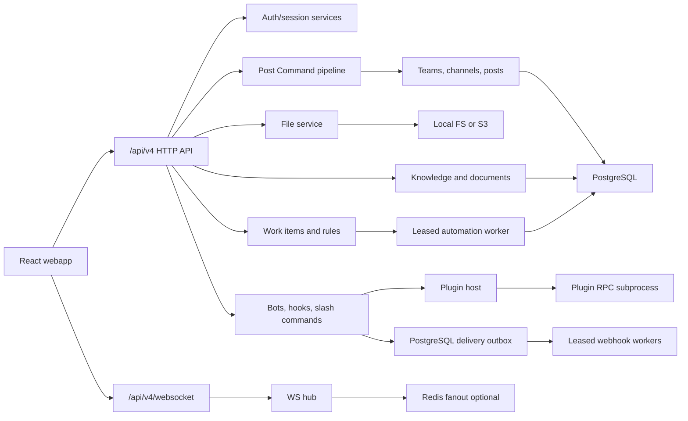

# Architecture

moyro is a small monorepo with a Go backend and a React web client. The server
owns compatibility with Mattermost-style `/api/v4` HTTP endpoints, WebSocket
events, webhooks, slash commands, and server plugin hooks. The webapp owns the
end-user chat experience and a lightweight web plugin registry.

## Server

Entry point: `server/cmd/moyro/main.go`.

The process loads config, opens PostgreSQL, runs checksummed versioned
migrations, bootstraps a default team/channel, starts the WebSocket hub,
optional Redis fanout, plugin host, configured email digest worker, scheduled
message worker, reminder worker, message-automation worker, and HTTP server.

Important packages:

- `internal/httpapi` wires routes and request handlers. Core handlers and the
  later compatibility waves live in separate files so one route family no
  longer owns the entire compatibility surface.
- `internal/application/postcommand` owns the shared post-write lifecycle for
  REST, MCP, scheduled, incoming-webhook, and slash-command adapters.
- `internal/store` owns immutable numbered migrations, checksums, the
  `schema_migrations` ledger, and startup advisory locking.
- `internal/auth`, `internal/pat`, `internal/oauth` handle identity and access.
- `internal/teams`, `internal/channels`, `internal/posts` are the chat core.
- `internal/files` supports local filesystem storage and S3-compatible storage.
- `internal/ws` owns live client connections and event broadcast.
- `internal/webhooks`, `internal/slashcmd`, `internal/bots` implement
  integration surfaces. Outgoing callbacks use PostgreSQL leases, retry
  history, deterministic delivery IDs, and dead-letter state.
- `internal/pluginhost` and `internal/rpcbridge` implement server plugin hooks.
- `internal/scheduled` and `internal/reminders` run background delivery loops.
- `internal/workitems` owns tasks, dependencies, recurrence, and decision
  lifecycle/history; `internal/automations` owns typed rules and leased runs.
- `internal/knowledge` and `internal/documents` provide offline PostgreSQL
  retrieval, citations, and source-watermarked conversation documents.
- `internal/inboxprefs` centralizes VIP, priority, bundling, snooze, and
  timezone-aware work-hour policy.
- `internal/metrics` exposes Prometheus metrics, including PostgreSQL pool
  saturation and the WebSocket hub's shed-event counters.
- `internal/ws` authorizes a scoped event against the candidate users this
  instance currently holds sockets for, and resolves that audience on a
  dedicated delivery goroutine. Registration and publication therefore stay
  responsive while a membership lookup is in flight; a saturated delivery queue
  sheds events and reports the drop rather than applying back-pressure to
  request handling.
- `internal/store` sizes the connection pool and applies per-session statement,
  lock, and idle-in-transaction timeouts. Any value specified in
  `POSTGRES_DSN` wins. Schema migrations acquire a connection with those
  timeouts lifted, because a table rewrite legitimately outruns a bound meant
  for a request-path query.

## Webapp

Entry point: `webapp/src/main.tsx`.

The React app initializes the plugin runtime, mounts Redux, and lazy-loads
login, Moyro Flow, workspace, personal settings, and administrator routes.
`ProductShell` owns global desktop/mobile navigation. The workspace keeps
`ChatView.tsx` as its orchestration boundary while rendering the sidebar,
header, message timeline, composer, and context panel through feature modules.
Session management, archived channels, and message actions live in their own
hooks under `features/workspace/model`. CI holds every large module below a
source-size ratchet (`scripts/check-source-sizes.sh`), including the files each
split produced, so the concentration cannot simply move to a sibling.

Important modules:

- `api/client.ts` re-exports the typed API boundary. The request builders live
  in `api/chat.ts`, `api/integrations.ts`, `api/compat.ts`, `api/moyro.ts`, and
  `api/media.ts`; `api/transport.ts` owns deadlines, the bounded retry of
  idempotent reads, and the `APIError` contract.
- `features/workspace/model/post-window.ts` bounds how many live posts the
  channel view retains, so a long-lived session in a busy channel cannot grow
  its state and DOM without limit.
- `features/theme/ThemePreferenceProvider.tsx` is the single owner of MUI,
  first-paint, local-cache, and server-backed theme state.
- `features/shell/ProductShell.tsx` owns the global rail and mobile bottom
  navigation shared by Flow, workspace, settings, and admin routes.
- `features/flow` owns Today, unified inbox, task/decision views, automation,
  approvals, AI assistant, and permission-scoped knowledge search.
- `features/workspace` owns the context sidebar, channel header, flat message
  timeline, scoped-draft composer, and thread/summary/file/info context panel.
- `hooks/useWebsocket.ts` owns reconnect and stale-socket guards.
- `components/MessageBody.tsx` renders sanitized Markdown and link previews.
- `components/IntegrationsPanel.tsx` exposes admin integration management.
- `plugins/runtime.ts` and `plugins/registry.ts` provide web plugin loading.

## Data Flow

1. REST, MCP, a scheduled worker, an incoming webhook, or a slash command
   submits a typed Post Command.
2. The command rechecks active-user and `create_post` authority, channel
   membership, and thread-root validity at the actual send time.
3. Server plugin `MessageWillBePosted` hooks may modify or reject the post;
   adapter-owned metadata is stripped and then reapplied by the server.
4. Post service persists the row and atomically enqueues matching typed
   automation actions before commit, then associates files, resolves mentions,
   and updates unread counters.
5. Server broadcasts `posted`, mention, and unread events over the hub.
6. `MessageHasBeenPosted` and link previews run asynchronously. Matching
   outgoing webhook callbacks are persisted before the dispatcher returns,
   then leased workers deliver them with stable idempotency headers.
7. The message-automation outbox shares the post transaction, then a leased
   worker applies stable idempotency keys and bounded retry. Outgoing webhook
   enqueue remains a separate integration commit.
8. Scheduled delivery prevents duplicate post rows with a unique
   `scheduled_post_id` and repairs file associations on replay. If the original
   post commit succeeds but its response is lost, the worker retrieves that row;
   post-commit notifications, audit, unread updates, and plugin hooks are still
   best-effort and are not transactionally replayed as a complete lifecycle.
9. Clients reconcile state from WebSocket events; after reconnect, the webapp
   refetches enough state to catch up.

## Compatibility Boundary

The compatibility promise lives at the HTTP/JSON, WebSocket event, and plugin
manifest/hook layers. Internal implementation details can remain simpler than
Mattermost as long as those boundaries stay predictable.
