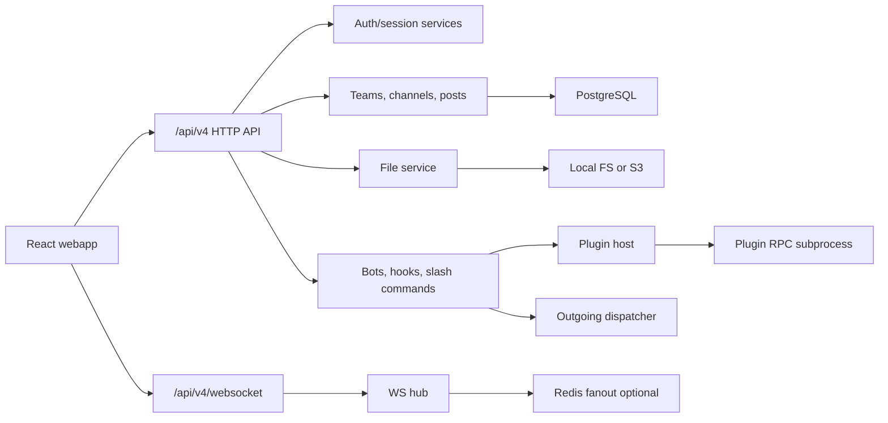

# Architecture

Moddle is a small monorepo with a Go backend and a React web client. The server
owns compatibility with Mattermost-style `/api/v4` HTTP endpoints, WebSocket
events, webhooks, slash commands, and server plugin hooks. The webapp owns the
end-user chat experience and a lightweight web plugin registry.

## Server

Entry point: `server/cmd/moddle/main.go`.

The process loads config, opens PostgreSQL, runs schema migration, bootstraps a
default team/channel, starts the WebSocket hub, optional Redis fanout, plugin
host, email digest worker, scheduled message worker, reminder worker, and HTTP
server.

Important packages:

- `internal/httpapi` wires routes and request handlers.
- `internal/store` owns DB migration and schema.
- `internal/auth`, `internal/pat`, `internal/oauth` handle identity and access.
- `internal/teams`, `internal/channels`, `internal/posts` are the chat core.
- `internal/files` supports local filesystem storage and S3-compatible storage.
- `internal/ws` owns live client connections and event broadcast.
- `internal/webhooks`, `internal/slashcmd`, `internal/bots` implement
  integration surfaces.
- `internal/pluginhost` and `internal/rpcbridge` implement server plugin hooks.
- `internal/scheduled` and `internal/reminders` run background delivery loops.
- `internal/metrics` exposes Prometheus metrics.

## Webapp

Entry point: `webapp/src/main.tsx`.

The React app initializes the plugin runtime, mounts Redux, and switches between
login and chat views. `ChatView.tsx` is currently the large application shell:
sidebar, channels, posts, composer, thread panel, modals, search, saved posts,
scheduled messages, reminders, and admin panels.

Important modules:

- `api/client.ts` is the typed API boundary for HTTP and WebSocket URLs.
- `hooks/useWebsocket.ts` owns reconnect and stale-socket guards.
- `components/MessageBody.tsx` renders sanitized Markdown and link previews.
- `components/IntegrationsPanel.tsx` exposes admin integration management.
- `plugins/runtime.ts` and `plugins/registry.ts` provide web plugin loading.

## Data Flow

1. Client sends HTTP writes such as `POST /api/v4/posts`.
2. Handler checks auth and membership.
3. Server plugin `MessageWillBePosted` hooks may modify or reject the post.
4. Post service persists the row and related metadata.
5. Server broadcasts `posted` over the hub.
6. Outgoing webhooks and `MessageHasBeenPosted` plugin hooks run after
   persistence.
7. Clients reconcile state from WebSocket events; after reconnect, the webapp
   refetches enough state to catch up.

## Compatibility Boundary

The compatibility promise lives at the HTTP/JSON, WebSocket event, and plugin
manifest/hook layers. Internal implementation details can remain simpler than
Mattermost as long as those boundaries stay predictable.
