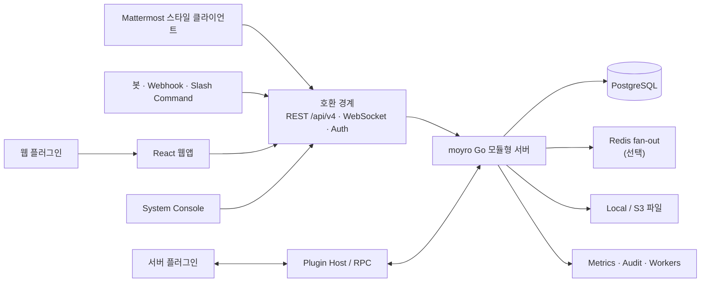

# moyro 프로젝트 방향성과 목표 분석

> 분석 기준일: 2026-08-30
> 역사 기준선: 기존 저장소의 `48e69ca`와 그 이전 커밋 이력
> 현재 상태 기준선: 2026-08-30 v0.2.1 릴리스 작업 트리와 제품·설계 문서, 서버·웹앱·플러그인 SDK 소스
> 문서 목적: 저장소에 남은 증거로 처음 지향한 제품 방향을 복원하고, 별도로 표시한 현재 상태 절에서 v0.2.1 릴리스가 그 방향에 어디까지 도달했는지 설명한다.

> **해석 주의:** 여기서 “원래 방향”은 최초로 복구 가능한 Git 스냅샷에 남은 방향을 뜻한다. Mattermost 호환은 설계 목표이며, 아래의 100% 수치는 특정 시점 작업 트리의 HTTP method/path 존재율이다. 공식 클라이언트의 행동 호환, 모든 기존 플러그인의 무수정 실행, 프로덕션급 온프레미스·HA·모바일·상용 준비 상태를 뜻하지 않는다.

## 1. 결론

moyro가 지향한 것은 **Mattermost 화면을 그대로 복제한 메신저**가 아니다. 핵심 목표는 Mattermost의 공개 호환 경계인 REST API v4, WebSocket 이벤트, 인증, 봇·웹훅·슬래시 명령, 플러그인 개념을 보존해 기존 생태계 자산의 이전 비용을 낮추면서, 내부는 더 작고 단순한 독립 구현으로 유지하는 **자체 운영형 팀 협업 플랫폼**을 만드는 것이다.

프로젝트의 설계 원칙은 다음 한 문장으로 요약할 수 있다.

> 내부 구현은 Mattermost보다 단순하게 유지하되, HTTP/JSON·WebSocket·플러그인 경계의 계약과 사용자에게 익숙한 작업 흐름은 예측 가능하게 보존한다.

이 판단은 다음 세 근거가 서로 일치하기 때문에 신뢰도가 높다.

- 최초 기준 문서는 “Mattermost 대체 가능한 자체 채팅 서버”, “기존 클라이언트·봇·플러그인의 재사용 비용 최소화”, “복제보다 Compatibility Layer”를 명시한다. ([requirements.md](requirements.md):5-13)
- 현재 README도 픽셀 단위 복제가 아니라 Mattermost 스타일의 클라이언트와 통합을 수용하는 실용적 호환 계층이라고 정의한다. ([README.md](../README.md):3-6)
- 현재 아키텍처 문서는 호환 약속을 HTTP/JSON, WebSocket, 플러그인 manifest/hook 경계에 두고 내부 구현은 더 단순해도 된다고 선언한다. ([architecture.md](architecture.md):77-81)

따라서 이 프로젝트의 북극성 지표는 “Mattermost와 얼마나 닮았는가”가 아니라 다음 세 가지다.

1. 기존 Mattermost 방식의 클라이언트와 통합이 수정 없이 핵심 업무를 완료하는가.
2. 자체 서버가 일상적인 조직 채팅과 운영을 독립적으로 감당하는가.
3. 그 호환성을 작은 코드베이스, 결정적인 확장 동작, 검증 가능한 계약으로 지속할 수 있는가.

## 2. 분석 방법과 한계

### 근거 수준

이 문서에서는 판단을 세 수준으로 구분한다.

- **명시된 목표**: README, 요건서, 로드맵, 설계 문서에 직접 쓰인 내용
- **강한 추론**: 여러 문서와 실제 코드·커밋 이력이 같은 방향을 가리키는 내용
- **미확정**: 저장소만으로 판단할 수 없거나 목표만 있고 구현 근거가 부족한 내용

### 역사 복원의 한계

- Git 이력은 2026-04-24의 `55d6ccf` (`chore: establish moyro baseline`)에서 시작한다. 이 첫 커밋에 이미 서버, 웹앱, SDK, 문서 등 약 2.9만 줄이 한꺼번에 들어와 있어 그 이전의 실제 기획·개발 과정은 복원할 수 없다.
- `v0.1.1` 안정화 작업 직전 `main`에는 27개 커밋과 `origin` 원격 저장소, 배포가 검증된 `v0.1.0` 태그가 있었다. 이 기록도 최초 스냅샷 이전의 기획 과정을 복원하지는 못하므로, 이 문서의 “원래 방향”은 창업자나 작성자의 회고가 아니라 **저장소 최초 스냅샷에서 확인되는 방향**을 뜻한다.
- [requirements.md](requirements.md)는 README에서 레거시 계획 문서로 분류되어 현재 동작의 기준 문서는 아니다. 다만 최초 커밋에 들어온 뒤 변경되지 않았으므로 원래 의도를 파악하는 사료로 사용하고, 반드시 현재 문서와 코드로 교차 검증했다. 현재 파일 자체는 정상적인 UTF-8 한국어로 읽힌다. ([README.md](../README.md):103-114)
- 분석 시점의 작업 트리에는 `v0.1.1` 안정화 후보가 있다. 번호형 DB migration, 공통 Post Command, 예약 작업 lease, 세션 JTI 해시, SMTP capability, durable webhook delivery와 route lazy loading을 포함하므로 아래 현황에서는 마지막 배포 태그와 릴리스 후보를 구분한다.

## 3. 프로젝트가 풀고자 한 문제

일반적인 팀 채팅 기능을 새로 만드는 것만으로는 이 프로젝트의 존재 이유를 설명하기 어렵다. 저장소에서 반복되는 문제 정의는 **Mattermost를 중심으로 쌓인 클라이언트·자동화·운영 지식을 버리지 않고 더 작은 자체 서버로 옮기는 비용**이다.

| 대상 | 기존 문제 | moyro이 제공하려 한 가치 | 근거 수준 |
| --- | --- | --- | --- |
| 조직의 일반 사용자 | 새 메신저로 이동할 때 채널·스레드·DM·검색 등 익숙한 흐름을 다시 배워야 함 | Mattermost에 가까운 채널 중심 작업 흐름과 자체 웹 클라이언트 | 명시 + 구현 |
| 시스템 관리자·DevOps | 자체 운영, 인증, 감사, 보존, 파일 저장, 상태 관측을 한곳에서 다뤄야 함 | 별도 System Console과 온프레미스 중심 운영 표면 | 명시 + 구현 |
| 봇·통합 개발자 | 서버 교체 시 API, 토큰, 웹훅, 슬래시 명령을 다시 작성해야 함 | `/api/v4`, Bearer 인증, PAT·Bot·Webhook·Command 호환 | 명시 + 구현 |
| 플러그인 개발자 | 기존 manifest, hook, UI 확장 개념을 버려야 함 | Mattermost 개념을 따르는 서버 RPC와 웹 registry | 명시 + 부분 구현 |
| 도입 의사결정자 | 대형 원본 제품을 그대로 복제·유지하면 변화 비용이 큼 | 외부 계약은 호환하고 내부는 작게 유지하는 독립 플랫폼 | 강한 추론 |

구체 산업, 조직 규모, 구매 주체는 명시되어 있지 않다. 다만 온프레미스, 감사, 권한, 데이터 보존, Redis·S3·Prometheus, air-gap 설정을 함께 고려한 점에서 개인용 메신저보다 **자체 운영이 필요한 조직 내부 협업 환경**이 주 대상이었다고 보는 것이 타당하다. ([mattermost-api-compatibility.md](mattermost-api-compatibility.md):295-309, [config.go](../server/internal/config/config.go):56-59)

## 4. 원래의 제품 목표와 우선순위

### 목표 1 — 공개 호환 경계를 최대한 보존한다

최우선 목표는 `/api/v4` 경로만 만드는 것이 아니라 다음 경계를 함께 맞추는 것이다.

- REST 경로, 인증 헤더, 페이지네이션, 필드명과 응답 형태
- `posted`, `typing`, `status_change`, `channel_updated` 등의 WebSocket 이벤트
- 세션, PAT, OAuth, Bot Token을 통한 인증 흐름
- `plugin.json`/`plugin.yaml` manifest와 서버·웹앱 확장 지점

최초 요건의 우선순위는 `API 호환 > 인증 호환 > 웹앱 확장 포인트 > 서버 플러그인 실행`으로 명시되어 있다. ([requirements.md](requirements.md):27-38, 84-113)

현재 호환성 문서는 이를 더 엄격하게 세 단계로 정의한다. ([mattermost-api-compatibility.md](mattermost-api-compatibility.md):59-71)

1. **Route shape**: 메서드와 경로가 존재한다.
2. **Behavioral contract**: 요청, 응답, 상태 코드, 오류, 인증, 권한이 맞는다.
3. **Client workflow**: 실제 클라이언트·봇·통합이 사용자 작업을 끝까지 완료한다.

즉 경로 수는 선행 지표일 뿐, 최종 성공 기준은 실제 흐름의 호환성이다.

### 목표 2 — 호환 프록시가 아닌 독립적인 채팅 제품을 만든다

moyro은 요청을 원본 Mattermost 서버로 전달하는 프록시가 아니다. 자체 PostgreSQL 모델과 서비스로 사용자, 팀, 공개·비공개 채널, DM/GM, 포스트, 스레드, 검색, 파일, 반응, 상태를 직접 처리한다. ([v0.1 baseline migration](../server/internal/store/migrations/000001_v0_1_baseline.up.sql):1-154)

MVP에는 다음 범위가 포함되었다. ([requirements.md](requirements.md):40-53, 148-151)

- 회원·프로필·상태, 팀·권한, Public/Private/DM/GM 채널
- 메시지·첨부·수정·삭제·답글·스레드, PostgreSQL FTS 검색
- 파일 업로드, 멘션·이메일, 저장 글
- PAT, Bot, OAuth, 웹훅, 슬래시 명령
- 웹 플러그인 일부와 최소 서버 플러그인

현재 소스에는 여기에 예약 메시지, 리마인더, 링크 미리보기, 채널 탐색과 사이드바 분류 같은 일상 기능도 포함되어 있다. ([README.md](../README.md):18-30)

### 목표 3 — 익숙한 UX를 계승하되 픽셀 복제는 하지 않는다

사용자 화면은 어두운 채널 탐색, 흰 메시지 영역, 압축된 헤더, 안정적인 RHS 스레드 패널, 낮은 장식 밀도처럼 장시간 협업에 익숙한 Mattermost 작업 모델을 따른다. ([user-design-rules.md](user-design-rules.md):5-20, 53-64)

관리 화면은 채팅 위의 보조 모달이 아니라 조직·워크스페이스·회원·채널·앱·보안·감사를 다루는 별도 고밀도 System Console을 지향한다. 주 사용자는 Org Owner, Org Admin, Workspace Admin, System Role Admin으로 정의되어 있다. ([admin-detail-screen.md](admin-detail-screen.md):5-34)

이는 README의 “pixel-for-pixel clone이 아니다”라는 선언과 모순되지 않는다. **시각적 동일성보다 학습 비용이 낮은 정보 구조와 작업 흐름을 보존**하려는 방향이다.

### 목표 4 — 플러그인을 장기적인 제품 축으로 만든다

플러그인은 부가 실험이 아니라 초기 아키텍처부터 들어간 핵심 축이다.

- 서버 플러그인은 별도 프로세스에서 실행되고 HashiCorp 스타일 handshake와 `net/rpc`를 사용한다.
- `MessageWillBePosted`는 게시물을 수정하거나 거절할 수 있고, `MessageHasBeenPosted`와 `ExecuteCommand` 같은 hook을 제공한다.
- hook은 등록 순서대로 결정적으로 실행되며, 실패와 종료 동작도 명시되어 있다.
- 웹 플러그인은 메뉴, 채널 헤더, 포스트 타입, RHS 확장 지점을 registry로 제공한다.

근거: [plugin-system.md](plugin-system.md):28-76, [host.go](../server/internal/pluginhost/host.go):125-227, [registry.ts](../webapp/src/plugins/registry.ts):28-76.

장기 목표였던 재시작 없는 설치·활성화·비활성화·삭제·설정은 현재 lifecycle에 구현됐다. 다음 운영 과제는 상태·로그·health·hook 오류와 장애 격리를 강화하는 것이다. ([plugin-system.md](plugin-system.md))

초기 구현은 `MOYRO_PLUGIN`, `moyro.v1`, RPC 서비스명 `Moyro`라는 자체 규약만 사용했다. 현재는 이 `moyro_v1`을 유지하면서 `mattermost_v1` 바이너리 런타임을 추가했다. Botman 0.1.2, Chatdump 0.5.1, Langflow 0.1.20과 local release gate의 EchoSummary 0.6.5는 실제 PostgreSQL archive 기능 시나리오를 거친다. 공개 CI는 checksum으로 고정한 EchoSummary 0.6.4 자산을 사용한다. 이 네 플러그인의 명시된 workflow만 경계에 포함되며 모든 Mattermost 플러그인·버전·기능에 대한 완전한 ABI·API 호환을 의미하지는 않는다. ([plugin-system.md](plugin-system.md))

### 목표 5 — 작은 내부 구조로 빠르게 진화한다

레거시 요건은 API Gateway, Auth Service, Chat Core, Realtime, Plugin Host 등의 논리 계층을 제시하지만, 실제 구현은 이들을 네트워크 마이크로서비스로 나누지 않았다. 한 Go 프로세스가 DB 마이그레이션, HTTP API, WebSocket hub, 플러그인 host, 이메일 digest, 예약 메시지와 리마인더 worker를 함께 시작한다. ([main.go](../server/cmd/moyro/main.go):26-143)

이는 미완성이라기보다 “외부 경계는 호환하되 내부는 작고 빠르게 바꾼다”는 목표에 맞춘 **모듈형 모놀리스 우선 전략**으로 보인다. 기능은 `internal/auth`, `teams`, `channels`, `posts`, `files`, `webhooks`, `pluginhost` 등의 패키지로 분리하고 조립은 한곳에서 수행한다. ([router.go](../server/internal/httpapi/router.go):64-189)

### 목표 6 — 단일 개발 서버에서 자체 운영형 제품으로 성숙한다

현재 코드는 PostgreSQL을 필수 저장소로 사용하고, 다음 운영 기능을 선택적으로 붙인다.

- Redis Pub/Sub을 통한 여러 서버 인스턴스의 WebSocket fan-out
- 로컬 파일 시스템 또는 S3 호환 저장소
- SMTP digest worker
- Prometheus 메트릭과 health endpoint
- Docker Compose 기반 PostgreSQL·Redis·MinIO 개발 환경

근거: [main.go](../server/cmd/moyro/main.go):39-124, [router.go](../server/internal/httpapi/router.go):73-86, 242-255, [compose.dev.yaml](../deploy/docker/compose.dev.yaml):3-37.

장기 계획에는 Linux, Kubernetes, 오프라인 패키지, HA, 백업·복구, 관측성 고도화가 포함되어 있다. 다만 현재 로드맵은 Operations를 `partial`로 표시하므로 이 항목들은 완성 사실이 아니라 목표다. ([requirements.md](requirements.md):127-146, [roadmap.md](roadmap.md):58-73)

## 5. 의도된 제품 구조

이 구조에서 대체 가능한 것은 내부 구현이고, 안정적으로 유지해야 하는 것은 바깥쪽 계약이다. 이 때문에 데이터 모델도 Mattermost에 가까운 필드명을 사용하지만, 내부 ID와 서비스 구성은 독립적으로 선택할 수 있다. ([v0.1 baseline migration](../server/internal/store/migrations/000001_v0_1_baseline.up.sql):1-3, [architecture.md](architecture.md):65-81)

## 6. 처음 계획한 성장 단계

최초 계획은 기능을 다음 순서로 확장하는 것이었다. ([requirements.md](requirements.md):137-151)

| 단계 | 의도한 결과 | 핵심 범위 |
| --- | --- | --- |
| 1. 채팅 기반 | 기본 채팅 서버 | 사용자·팀·채널·포스트·인증·WebSocket |
| 2. 통합 호환 | 외부 자동화 수용 | `/api/v4`, Bot, Webhook, Slash Command |
| 3. 웹 확장 | 플러그인 1차 | manifest loader, web loader, registry |
| 4. 서버 확장 | 서버 플러그인 실행 | Plugin Host, RPC, 핵심 hook |
| 5. 운영 제품 | 조직 도입 가능성 확보 | System Console, Marketplace, Audit, HA, 검색 |
| 6. 상용 수준 | 넓은 클라이언트·기업 요구 | 모바일, 엔터프라이즈 기능 |

현재 로드맵은 이 순서를 폐기한 것이 아니라 Foundation, Compatibility, Usability, Operations, Extension Platform이라는 **성숙도 축**으로 재정리했다. ([roadmap.md](roadmap.md):1-90)

## 7. 커밋 이력이 보여 주는 실행 방향

| 시기 | 관찰된 변화 | 해석 |
| --- | --- | --- |
| 2026-04-24 | `55d6ccf`에 채팅 코어, 웹앱, 플러그인 SDK, 운영 골격과 요건서가 함께 유입 | 프로젝트의 실제 시작점이 아니라 이미 진행된 결과를 가져온 기준 스냅샷 |
| 2026-04-25 | 공식 OpenAPI와 로컬 route shape 비교 도구, 핵심 API alias, 로그인·읽음 상태 호환 추가 | 호환성을 감각이 아닌 수치와 클라이언트 부팅 흐름으로 관리하기 시작 |
| 2026-04-26~28 | 관리자·Enterprise·Access Control 경로와 System Console 확대 | 일반 채팅에서 조직 운영·관리 호환으로 범위 확장 |
| 2026-04-28~29 | 관리자와 사용자 화면의 시각 체계 정리, Mattermost 작업 흐름에 맞춘 UI | 기능 폭 이후 사용성과 친숙도 보강 |
| v0.1.1 릴리스 후보 | 번호형 migration, 공통 Post Command, 예약 lease/idempotency, 세션 JTI 해시, SMTP capability, PostgreSQL webhook delivery, handler 분할과 route lazy loading | 기능 폭을 더 넓히기보다 공통 권한·감사 경계와 재시작·다중 worker 안전성, 배포 검증을 강화하는 중 |

최초 기준선 이후 22개 커밋의 제목은 `feat` 12개, `style` 4개, `fix` 3개, `chore`·`test`·`docs` 각 1개다. 짧은 기간에 호환 범위와 화면을 빠르게 넓혔다는 장점이 있지만, 동작 계약·운영·테스트의 깊이가 그 속도를 따라가야 하는 단계라는 뜻이기도 하다.

### 방향이 바뀌었는가

핵심 방향은 바뀌지 않았다. 최초 요건, README, 현재 아키텍처, 커밋 이력이 모두 호환 플랫폼을 가리킨다. 다만 실행의 초점은 다음처럼 이동했다.

1. 독립 채팅 코어 확보
2. API route-shape 범위 확대
3. 관리자·Enterprise 호환 표면 확대
4. 사용자·관리자 UI 정렬
5. stub을 실제 저장과 계약으로 교체하는 단계

최근의 위험은 **호환 경로의 폭과 UI 유사성이 실제 행동 호환보다 앞서는 것**이다. 이는 미션 변경이 아니라 우선순위 지표가 잘못 대체될 수 있는 실행상 위험이다.

## 8. 현재 구현과 원래 목표의 거리

이 절부터는 위의 역사 복원과 달리 **2026-08-30 v0.2.1 릴리스 작업 트리의 현재 상태**를 설명한다. 따라서 최초 분석 뒤에 해결된 항목은 해결 상태와 남은 회귀 검증을 함께 기록한다.

| 영역 | 현재 판단 | 근거와 남은 거리 |
| --- | --- | --- |
| 채팅 Foundation | 대체로 구현 | 인증, 팀·채널, DM/GM, 포스트·스레드, 파일, 반응, 검색, 읽음·멘션 상태가 소스와 스키마에 존재. 현재 로드맵도 `mostly present`로 평가한다. |
| REST route shape | 넓게 확보 | 2026-04-28 작업 트리 audit는 공식 539개 중 539개 match, 100%를 기록한다. 그러나 이는 당시 작업 트리 측정이며 행동 호환이나 현재 고정 릴리스 계약 수치가 아니다. ([mattermost-api-compatibility.md](mattermost-api-compatibility.md):252-268) |
| 행동·오류 계약 | 부분 구현 | router와 handler에 이메일 확인, MFA, 채널 view, 업로드, recap, AI, cloud 등 200/빈 응답 stub이 다수 명시되어 있다. 성공·오류·권한·not-found 계약 테스트가 더 필요하다. |
| 실제 클라이언트 호환 | 입증 부족 | 자체 React 웹앱은 동작하지만 공식 desktop/mobile/SDK의 end-to-end 호환 결과와 버전별 지원표는 없다. 최초 “샘플 80%” 기준도 자동화된 결과로 남아 있지 않다. |
| 서버 플러그인 | 네 실제 archive의 기능 경로 동작 | `moyro_v1` SDK 플러그인과 테스트된 `mattermost_v1` 바이너리 ABI를 함께 지원한다. 관리자 tar.gz upload, replace, enable/disable/delete, 암호화 설정, PostgreSQL KV, plugin HTTP와 재시작 복구가 구현됐다. Botman 0.1.2 status/config 보안, Chatdump 0.5.1 export/config/replace, Langflow 0.1.20 mock SSE bot post/update/event/history, EchoSummary 0.6.5 mock vLLM slash/DM을 실제 PostgreSQL archive E2E로 검증한다. 공개 CI의 EchoSummary fixture는 checksum-pinned 0.6.4다. 모든 native 플러그인은 여전히 완전 신뢰 코드이고, 지원하지 않는 Mattermost API·서명·sandbox·Marketplace는 후속 범위다. ([plugin-system.md](plugin-system.md)) |
| 웹 플러그인 | 테스트된 registry/store 표면 동작 | 인증된 bundle discovery와 동적 load/unload, 공유 React·Redux·Router globals, bounded Mattermost-shaped users/teams/channels/posts/preferences/RHS state, thunk dispatch, channel header, post renderer, official-style RHS action, custom WebSocket handler, admin callback/custom setting과 user setting 소비가 연결됐다. Mattermost 전체 web registry/store 계약과 bundle 오류 격리는 지원 범위가 아니다. ([registry.ts](../webapp/src/plugins/registry.ts), [runtime.ts](../webapp/src/plugins/runtime.ts)) |
| System Console | 지원 기능은 실제 API에 연결 | 별도 full-page 운영 면과 사이트·OIDC·AI·키·역할·MCP·승인 관리 API가 연결돼 있다. 유효 권한에 따라 위임 관리자 메뉴와 route를 제한하며, 레거시 호환 화면의 미지원 변경은 명시적인 not-supported 응답을 사용한다. Enterprise 전체 호환 화면이 실제 제품 기능이라는 뜻은 아니다. ([AdminAccessContext.tsx](../webapp/src/features/admin/AdminAccessContext.tsx), [AppRouter.tsx](../webapp/src/app/AppRouter.tsx)) |
| WebSocket 권한 경계 | 차단 위험 해결, 회귀 유지 필요 | channel/team event는 DB membership으로 audience를 해석하고 resolver가 없거나 실패하면 fail closed한다. user 전용과 전역 event 의미도 분리해 단위 회귀 테스트를 추가했다. 실제 PostgreSQL을 둔 다중 사용자 E2E는 계속 릴리스 회귀 항목으로 유지한다. ([hub.go](../server/internal/ws/hub.go), [audience.go](../server/internal/ws/audience.go), [hub_test.go](../server/internal/ws/hub_test.go)) |
| 세션 폐기 | 차단 위험 해결, 회귀 유지 필요 | HTTP와 WebSocket의 최초 인증은 JWT 서명뿐 아니라 live session, 만료와 active user를 확인한다. logout은 session을 삭제하고 기존 WebSocket도 즉시 종료한다. revoke·inactive까지 포함한 실제 서버 통합 회귀는 계속 보강 대상이다. ([auth.go](../server/internal/auth/auth.go), [handler.go](../server/internal/ws/handler.go), [handlers.go](../server/internal/httpapi/handlers.go)) |
| 메시지 쓰기 경로 | 핵심 경로 통합 | REST, MCP 직접·승인 실행, 예약 worker, Incoming Webhook과 내장·플러그인 Slash Command의 in-channel 결과가 공통 Post Command를 호출해 권한, plugin hook, mention/unread, 실시간 event, webhook enqueue와 감사를 같은 순서로 적용한다. 저수준 `posts.Service`는 저장 adapter 역할만 맡는다. |
| DB 변경 관리 | 번호형 migration 도입 | 체크섬과 적용 이력을 기록하는 순차 migration과 PostgreSQL 15/16 lifecycle test를 도입했다. v0.1 baseline은 불변 migration으로 보존한다. |
| 비동기 내구성 | lease/outbox 도입, 원자성 경계 남음 | 예약 발송은 claim token·lease·attempt·unique result post로 중복을 막고, outgoing webhook은 PostgreSQL delivery/attempt/DLQ 상태로 재시작 후 복구된다. 다만 post 저장과 webhook enqueue는 아직 별도 transaction이라 그 사이의 crash gap은 남아 있다. |
| Moyro Flow 읽기 모델 | durable inbox와 업무 객체 구현 | 한 번의 flow-summary 요청으로 현재 team·channel·membership counter를 조회한다. 사용자별 activity event는 mention·DM·thread reply·승인·리마인더·task assignment·plugin event를 PostgreSQL에 dedupe해 저장하고 cursor, unread filter, read/completed/snooze 상태를 제공한다. Task는 생성자·담당자, Decision은 원본 채널 멤버에게만 보이며 원본 post와 현재 멤버십을 매 요청 재검증한다. |
| 운영 | 부분 구현 | health, metrics, Redis fan-out, S3, SMTP worker는 존재. 실제 K8s 배포, backup/restore, 운영 config reference, 완전한 HA 검증은 문서상 다음 작업이다. |
| 보안·Enterprise | 제품 범위는 구현, 호환 표면은 혼합 | DB RBAC·감사·rate limit, Keycloak OIDC, 개인 API/MCP 키와 승인 정책은 구현됐다. 승인 API는 raw payload 대신 서버 redaction과 길이 제한을 거친 safe preview를 반환한다. MFA, LDAP/SAML, 보존 정책, 플러그인 서명·sandbox 같은 Mattermost Enterprise 범위는 미지원 또는 후속이며 v0.2.1 릴리스의 native 플러그인은 완전 신뢰 코드다. |
| 모바일·음성·화상 | 범위 밖 또는 후속 | MVP에서 음성·화상은 제외되고 모바일은 후속 단계다. 현재 저장소에는 네이티브 모바일 앱이 없다. |

WebSocket audience와 live-session 검증은 최초 분석에서 확인한 릴리스 차단 위험이었으나 v0.2.1 기준선에서 수정 상태를 유지한다. 이 평가는 단위·패키지 테스트와 정적 소스 감사에 근거하며 별도 침투 테스트 결과는 아니다. 따라서 해결된 항목을 다시 깨뜨리지 않도록 통합·브라우저 회귀 gate는 유지해야 한다.

참고로 audit 스크립트의 동일한 method/path 파서를 당시 539개 공식 목록에 적용한 비교에서는 현재 clean `HEAD`가 local 379개, match 333개, missing 206개(61.78%)이고 작업 트리가 local 595개, match 539개(100%)였다. 이 61.78%도 당시 목록을 재사용한 파생 비교치이지 최신 공식 Mattermost 기준은 아니다. 핵심은 **100%가 커밋·릴리스 기준선이 아니라는 점**이다. 감사 도구 자체도 body, status, auth, error, side effect를 검사하지 않는다. ([audit-mattermost-api.ps1](../scripts/audit-mattermost-api.ps1):59-128)

### v0.2.1 릴리스 검증 범위

- `server`의 `go test -race ./...`, `go vet ./...`, `govulncheck ./...`: 통과했고 Moyro 실행 경로에서 도달 가능한 취약점은 0건이다. 현재 서버에는 284개의 `Test*` 함수가 있지만 여전히 직접 테스트가 없는 서비스 패키지가 있다.
- `plugin-sdk/go`의 `go test -race ./...`와 `go vet ./...`: 통과.
- 웹앱 의존성 감사, `npm test`, `npm run typecheck`, `npm run build`: 통과했고 npm 취약점은 개발 의존성을 포함해 0건이다. route lazy loading으로 Flow·설정·관리·채팅 기능을 별도 chunk로 분리했지만, 데이터 그리드가 포함된 개인 키 feature chunk는 추가 분리 대상이다.
- PostgreSQL 15·16 고정 digest별 migration·store·RBAC·승인·세션 통합 테스트와 race·vet 검증: 통과.
- v0.2.1 linux/amd64 non-root Docker 이미지의 Playwright release scenario는 제품 route·새로고침·권한 변경·승인 idempotency·세션 폐기·REST 오류 계약·로그인/프로필 버전·Moyro Flow 원문 이동·모바일 viewport·실제 plugin archive·브라우저 오류를 검증한다. ([package.json](../webapp/package.json), [product-pages.spec.ts](../webapp/e2e/product-pages.spec.ts), [plugin-compatibility.spec.ts](../webapp/e2e/plugin-compatibility.spec.ts))
- v0.2.1 화면 카탈로그는 46개 실제 캡처다. 29개 인증 desktop route, desktop 컨텍스트 상태, 로그인·프로필 메뉴, 네 개의 plugin compatibility 상태와 10개 mobile 상태를 포함한다. 정적 검증은 HTML 링크·JSON-LD와 JPEG SOF 실제 크기/HTML 선언을 확인한다. 이 증거는 명시된 화면과 plugin workflow의 회귀 범위이며 임의의 Mattermost 플러그인이나 모든 클라이언트 호환을 의미하지 않는다.
- tag workflow는 `moyro-v0.2.1.tar.gz`를 만든 뒤 내부 전용 Docker network에서 다시 load해 offline startup, web UI/version, bootstrap login, restart와 정확히 네 개의 애플리케이션 환경변수를 검증한 자산 하나만 GitHub Release에 게시한다. Pages workflow는 `docs/` 홍보·가이드·실제 제품 캡처를 별도로 배포한다.
- OpenAPI 3.1은 Mattermost 호환 [`openapi-v4.yaml`](openapi-v4.yaml)과 Moyro native [`openapi-moyro.yaml`](openapi-moyro.yaml)로 분리한다. 전자는 37개 호환 path의 핵심 workflow 초안이고, 후자는 system capability, site·draft policy, 근거 기반 운영 상태, flow-summary, durable activity event, work item과 safe approval preview의 12개 native path를 실제 handler DTO에 맞춰 기술한다. 둘 다 전체 router의 완전한 계약 문서는 아니므로 router와 OpenAPI 수렴은 계속 필요하다.
- `handlers.go` 약 10,100줄은 `handlers.go` 4,974줄과 `compat_wave_handlers.go` 5,084줄로 분할했다. `ChatView.tsx`는 워크스페이스 feature와 예약·리마인더 다이얼로그를 추출해 1,939줄까지 줄였고 `IntegrationsPanel.tsx`는 1,902줄이다. 남은 대형 파일에는 CI source-size ratchet을 적용해 다시 커지지 않게 했다.

## 9. 원래 방향에서 제외되거나 후순위였던 것

다음 항목은 프로젝트의 핵심 목표로 과장하면 안 된다.

- **픽셀 단위 Mattermost 복제**: 명시적으로 부정되어 있다.
- **Mattermost 내부 구조의 재현**: 호환 약속은 공개 경계에 있고 내부는 단순화할 수 있다.
- **모든 Enterprise·Cloud·AI 기능의 실제 제공**: backing service가 없으면 호환되는 disabled/not-available 응답을 주는 것이 현재 전략이다. ([mattermost-api-compatibility.md](mattermost-api-compatibility.md):106-114)
- **모든 기존 서버 플러그인 바이너리의 완전한 ABI 호환**: `mattermost_v1`은 검증된 ABI·API subset이며, 그 밖의 플러그인은 개별 호환성 검증이 필요하다.
- **초기 네이티브 모바일 앱, 음성·화상**: 모바일은 후속이고 음성·화상은 MVP에서 제외되었다.
- **SaaS 또는 멀티테넌트 사업**: 조직/워크스페이스 UI 개념은 있지만 배포·테넌시 모델은 문서로 확정되지 않았다.
- **특정 상용화·오픈소스 모델**: “상용 수준”이라는 성숙도 표현은 있으나 저장소에 LICENSE와 사업 모델이 없다.

## 10. 원래 방향에 충실한 다음 우선순위

이 절은 과거 문서의 직접 인용이 아니라, 위 목표와 현재 간극을 연결한 분석 제안이다.

### 0순위 — 해결된 인증·실시간 경계를 릴리스 회귀 gate로 고정

- membership 기반 WebSocket audience와 resolver 오류 시 fail-closed 동작을 유지한다.
- HTTP·WebSocket 인증의 live-session/active-user 검증과 logout socket 종료를 유지한다.
- 실제 PostgreSQL에서 비공개 채널 교차 사용자, logout, 관리자 revoke와 inactive 사용자를 함께 검증하는 통합 회귀를 태그 전 실행한다.

### 1순위 — Route parity를 행동 호환으로 전환

- 지원할 Mattermost 버전과 핵심 workflow 목록을 고정한다.
- 각 workflow에 성공, 잘못된 body, 인증 없음, 권한 거부, not-found, pagination 계약 테스트를 둔다.
- “실제 구현”, “의도된 disabled 응답”, “호환 stub”을 API 지원표에서 분리한다.
- 경로 수가 아니라 공식 client boot, 채널 탐색, 게시·스레드, 파일, 알림, Bot·Webhook·Command 완료율을 release gate로 사용한다.

### 2순위 — 공식 스타일 클라이언트와 통합의 회귀 테스트

- Mattermost JS/Go client 또는 고정 HTTP fixture로 핵심 계약을 자동화한다.
- WebSocket reconnect, event payload, unread reconciliation을 통합 테스트한다.
- 자체 웹앱의 로그인→팀 선택→채널→게시→스레드→검색 흐름을 브라우저 E2E로 만든다.

### 3순위 — stub의 제품 정책을 명확히 함

- 핵심 사용자 흐름의 stub은 실제 서비스와 영속 저장으로 교체한다.
- 제공하지 않을 Enterprise/Cloud 기능은 거짓 성공보다 예측 가능한 disabled/not-available 응답을 유지한다.
- System Console에서 “지원됨”, “호환 응답만 제공”, “미지원” 상태를 운영자에게 그대로 보여 준다.

### 4순위 — 확장 플랫폼의 운영 가능성 완성

- 구현된 설치·활성화·비활성화·삭제·설정·재시작 lifecycle에 health, hook timeout, 장애 격리를 추가한다.
- 지원하는 Mattermost API subset을 실제 플러그인 계약 테스트와 함께 점진적으로 넓힌다.
- 서버 API 권한 모델을 세분화하고 웹 bundle 오류 격리를 강화한다.

### 5순위 — 자체 운영 제품의 기본기

- 단일 VM과 Kubernetes 배포, PostgreSQL·파일 backup/restore, 비밀값·TLS, upgrade/migration runbook을 문서화한다.
- Redis·S3·SMTP 장애 시 보장 범위와 HA 검증 시나리오를 정한다.
- 감사 이벤트와 관리자 권한 변경 경로를 완성한다.

### 6순위 — 코드 구조와 문서의 수렴

- 거대한 `handlers.go`, `ChatView.tsx`, `IntegrationsPanel.tsx`를 도메인·페이지 단위로 분리하되 외부 계약은 바꾸지 않는다.
- 실제 router에서 OpenAPI 또는 지원 매트릭스를 생성해 문서와 구현의 이중화를 줄인다.
- TypeScript 옆의 레거시/generated JavaScript 파일의 생성·관리 정책을 명확히 한다.

## 11. 아직 결정되지 않은 전략 질문

다음 질문은 저장소만으로 답할 수 없으며, 제품 책임자가 명시해야 한다.

1. 어느 Mattermost 릴리스 또는 API 스냅샷을 지원 기준으로 삼는가?
2. “호환”의 보증 단위는 route, 공식 SDK, desktop/mobile client, 플러그인 source portability 중 어디까지인가?
3. 주 배포 모델은 단일 조직 온프레미스, 관리형 단일 테넌트, 멀티테넌트 SaaS 중 무엇인가?
4. 플러그인은 source-level 포팅을 목표로 하는가, API adapter를 제공할 것인가, 바이너리 호환까지 추구하는가?
5. Enterprise 기능은 실제 구현할 제품 범위인가, 클라이언트 부팅을 위한 disabled surface로 남길 것인가?
6. 네이티브 모바일 앱을 만들 것인가, 기존 Mattermost 모바일 클라이언트 호환을 목표로 할 것인가?
7. 라이선스, 배포 권한, Marketplace와 상용화 모델은 무엇인가?

## 12. 최종 정의

저장소의 증거를 바탕으로 원래 프로젝트를 가장 정확하게 정의하면 다음과 같다.

> **moyro은 Mattermost의 공개 API·실시간 이벤트·통합·확장 개념과 익숙한 협업 흐름을 계승하면서, 내부는 Go·React·PostgreSQL 기반의 더 작고 독립적인 구조로 유지하는 자체 운영형 채팅 및 확장 플랫폼이다. 초기 목적은 기존 생태계 자산의 이전 비용을 줄이는 것이며, 장기적으로는 행동 계약이 검증된 호환성, 결정적인 플러그인 실행, 운영자 중심 System Console, 선택적 수평 확장과 배포 운영성을 갖춘 조직용 제품으로 성숙하는 것이었다.**

현재 구현은 채팅 Foundation과 route-shape 폭에서는 상당히 전진했지만, 원래 목표의 완성 여부는 100% route 수치가 아니라 실제 클라이언트 workflow, 권한·오류 계약, 플러그인 lifecycle, 운영·보안 검증으로 판단해야 한다.
