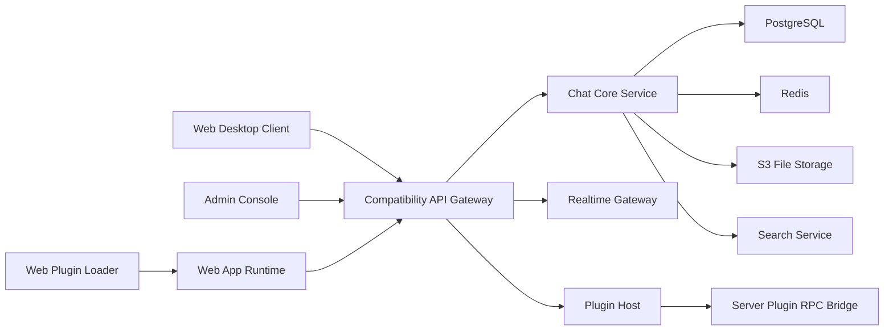

# Moddle — Mattermost 호환 채팅 플랫폼 개발 요건서

> 코드명: RelayChat · 제품명: **Moddle** · 설계 전략: *Mattermost Compatible Platform*

## 1. 프로젝트 목표

| 항목    | 내용                                                |
| ----- | ------------------------------------------------- |
| 목표    | Mattermost 대체 가능한 자체 채팅 서버 구축                     |
| 핵심 방향 | Mattermost REST API v4 계열 최대 호환, 기존 플러그인 구조 최대 호환 |
| 우선순위  | API 호환 > 인증 호환 > 웹앱 확장 포인트 호환 > 서버 플러그인 실행 호환     |
| 구현 원칙 | 기존 Mattermost 클라이언트·봇·플러그인의 재사용 비용 최소화            |
| 권장 전략 | 완전 동일 재현보다 **Compatibility Layer** 중심 설계          |

## 2. 네이밍

| 구분        | 제안명                         |
| --------- | --------------------------- |
| 제품명       | Moddle                      |
| 서버명       | Moddle Server               |
| 웹앱명       | Moddle Web                  |
| 플러그인 SDK  | Moddle Plugin SDK           |
| API 호환 계층 | Moddle MM Compatibility API |
| 앱스토어      | Moddle Marketplace          |
| CLI       | moddlectl                   |

## 3. 호환 목표

| 호환 영역         | 목표 수준 | 상세                                             |
| ------------- | ----- | ---------------------------------------------- |
| REST API      | 높음    | `/api/v4` 경로·인증 방식·응답 스키마 최대 호환                |
| WebSocket 이벤트 | 높음    | `posted`, `typing`, `channel_updated` 등 핵심 이벤트 |
| 인증            | 높음    | PAT, OAuth 2.0, Bot Token                      |
| 플러그인 manifest | 높음    | `plugin.json` / `plugin.yaml` 로딩 호환            |
| 웹앱 플러그인       | 중상    | registry 기반 주요 UI 확장 포인트                       |
| 서버 플러그인       | 중     | RPC Hook 호환 계층                                 |
| 모바일           | 중     | 초기 웹 반응형, 후속 앱 호환                              |
| 관리 콘솔         | 중상    | 플러그인 설치·활성화·로그                                 |

## 4. 제품 범위

| 범주   | 필수 기능                   |
| ---- | ----------------------- |
| 사용자  | 회원·프로필·상태·알림 설정         |
| 팀    | 팀 생성·가입·권한              |
| 채널   | Public / Private / DM / GM |
| 메시지  | 텍스트·첨부·수정·삭제·답글·스레드     |
| 검색   | 메시지·채널·사용자 (PG FTS 우선)  |
| 파일   | 업로드·다운로드·썸네일 (S3 호환)    |
| 알림   | 멘션·푸시·이메일               |
| 관리   | 시스템 설정·플러그인·감사 로그       |
| 통합   | 웹훅·봇·슬래시 커맨드·OAuth 앱    |
| 플러그인 | 서버·웹앱·설정 UI             |

## 5. 아키텍처 계층

| 계층                  | 요건                                |
| ------------------- | --------------------------------- |
| API Gateway         | `/api/v4` 호환 엔드포인트                |
| Auth Service        | 세션·JWT·PAT·Bot Token·OAuth 2.0    |
| Chat Core           | 팀·채널·포스트·리액션·스레드                  |
| Realtime            | WebSocket + PubSub                |
| Plugin Host         | 서버 플러그인 실행 + RPC 브리지              |
| Web Plugin Runtime  | 웹앱 플러그인 로더 + registry             |
| File Service        | 로컬 또는 S3 호환                       |
| Search              | PostgreSQL FTS → OpenSearch 옵션    |
| Admin Console       | 설정·감사·플러그인·모니터링                   |
| Compatibility Layer | 응답 형식·에러 코드·엔드포인트 매핑              |

## 6. 기술 스택

| 영역       | 권장안                             | 대안                |
| -------- | ------------------------------- | ----------------- |
| 서버       | Go                              | Rust              |
| 웹앱       | React + TypeScript              | Next.js           |
| DB       | PostgreSQL 15+                  | CockroachDB       |
| 캐시       | Redis                           | KeyDB             |
| 실시간      | WebSocket + Redis PubSub        | NATS              |
| 검색       | PostgreSQL FTS                  | OpenSearch        |
| 파일       | S3 호환                           | MinIO             |
| 플러그인 RPC | HashiCorp go-plugin 호환 구조       | gRPC 브리지          |
| 배포       | Kubernetes                      | Docker Compose    |

## 7. API 호환 요건

- URI: `/api/v4/*`
- 인증 헤더: `Authorization: Bearer <token>`
- 페이지네이션: `page`, `per_page`
- 리소스 ID: UUID (MM 26자 호환 또는 필드명 유지)
- WebSocket 이벤트: `hello`, `posted`, `typing`, `status_change`, `channel_updated`, `user_added`, `user_removed`, `post_edited`, `post_deleted`, `reaction_added`, `reaction_removed`
- OpenAPI 3.1 자동 생성
- Mattermost JS/Go 공식 클라이언트 연동 테스트

## 8. 플러그인 호환 요건

### 8-1. 공통
- `plugin.json` / `plugin.yaml` 로딩
- id·name·version·min_server_version·homepage_url·server.executable·webapp.bundle_path·settings_schema 지원
- 서명 검증 (선택)

### 8-2. 서버 플러그인
- 프로세스 격리 실행
- RPC 브리지 (HashiCorp go-plugin 호환 구조)
- Hook: `OnActivate`, `OnDeactivate`, `OnConfigurationChange`, `MessageWillBePosted`, `MessageHasBeenPosted`, `ServeHTTP`
- API 어댑터: 포스트·채널·사용자 CRUD
- 플러그인별 로그 분리
- 비정상 종료 재시작 정책

### 8-3. 웹앱 플러그인
- PluginClass `initialize` / `uninitialize`
- `registerRootComponent`, `registerChannelHeaderButtonAction`, `registerPostTypeComponent`, `registerPostDropdownMenuComponent`, `registerRightHandSidebarComponent`, `registerMainMenuAction`
- Redux 상태 노출 래퍼
- SDK 버전 adapter

## 9. 데이터 모델 (요약)

`User`, `Team`, `Channel`, `ChannelMember`, `Post`, `FileInfo`, `Reaction`, `Preference`, `Session`, `Plugin`, `AuditLog`, `OAuthApp`, `Bot`

## 10. 관리자 기능

시스템 설정, 플러그인 관리(업로드·활성화), 운영 현황(동시접속·TPS), 감사 로그, 사용자 관리, 메시지 정책(보존·금칙어), 외부 연동.

## 11. 보안

OAuth 2.0 + SSO + MFA(선택), 토큰 분리 관리, RBAC, TLS·저장 암호화(선택), 플러그인 샌드박스·권한 제한, 감사 로깅, Vault/KMS, 서명 검증, SBOM.

## 12. 비기능 요건

- 가용성: HA 옵션
- 성능: 메시지 1초 이내 게시, WS 지연 최소화
- 확장성: API 수평, 실시간 서버 분리
- 관측성: OpenTelemetry + Prometheus + Grafana
- 배포: Docker·K8s·오프라인 패키지
- 테스트: 계약·플러그인·부하
- 플랫폼: Linux 우선

## 13. 단계별 로드맵

| 단계  | 범위                                          | 결과물        |
| --- | ------------------------------------------- | ---------- |
| 1   | 사용자·팀·채널·포스트·인증·WS                          | 기본 채팅 서버   |
| 2   | `/api/v4` 핵심·봇·웹훅·슬래시 커맨드                   | 외부 연동      |
| 3   | manifest 로더·웹앱 loader·registry 일부 호환        | 플러그인 1차    |
| 4   | 서버 플러그인 Host·RPC·Hook 일부 호환                 | 서버 확장      |
| 5   | 관리 콘솔·마켓플레이스·감사·HA·검색 고도화                   | 운영형 제품     |
| 6   | 모바일 앱·엔터프라이즈 기능                             | 상용 수준      |

## 14. MVP 범위

포함: 채팅 기본, 스레드, DM/GM, 파일 업로드, PG FTS 검색, PAT, Bot, OAuth 2.0, 웹훅, 슬래시 커맨드, 웹앱 플러그인 부분, 서버 플러그인 최소.
제외: 모바일 앱, 음성·화상.

## 15. 호환성 검증 기준

- MM 공식 클라이언트 샘플 80% 이상 정상 동작
- Bot·웹훅·슬래시 커맨드·플러그인 샘플 로딩
- `plugin.json` 로딩 성공
- 하위 호환 정책 문서화

## 16. 리스크

완전 호환 난이도, 웹앱 SDK 차이, 서버 플러그인 RPC ABI, API 필드 차이, 운영 복잡도, 서드파티 플러그인 보안 — 각각 호환 등급 문서화·adapter·계약 테스트·Host Supervisor·서명 모델로 대응.

## 17. 최종 추천

- 최종 제품명: **Moddle**
- 전략: Compatible Platform (Clone X)
- 1차: REST v4 + WebSocket + 웹앱 플러그인 일부
- 2차: 서버 플러그인 RPC Host
- 스택: Go + React + PostgreSQL + Redis
- 운영: Linux + K8s + 패키지 배포

## 18. 아키텍처 다이어그램

